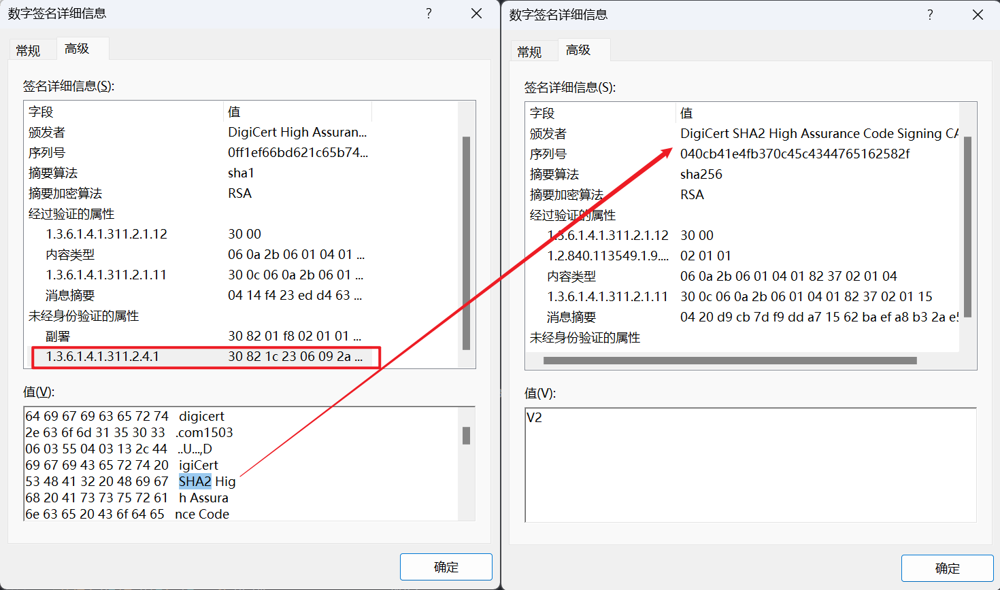
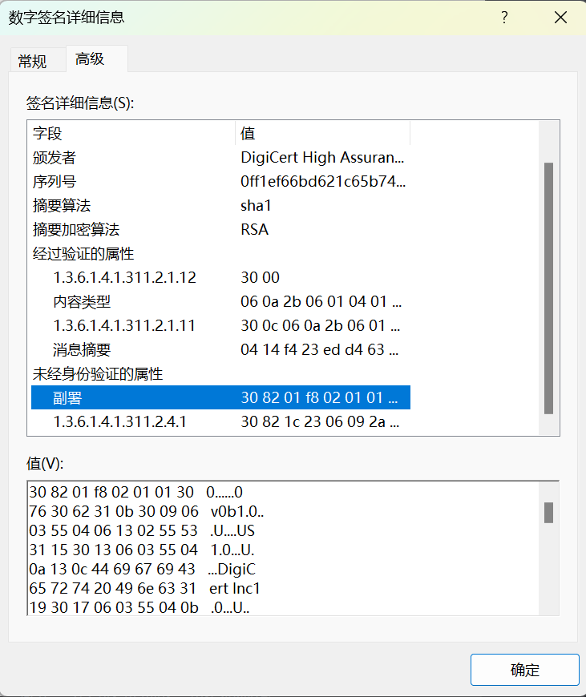
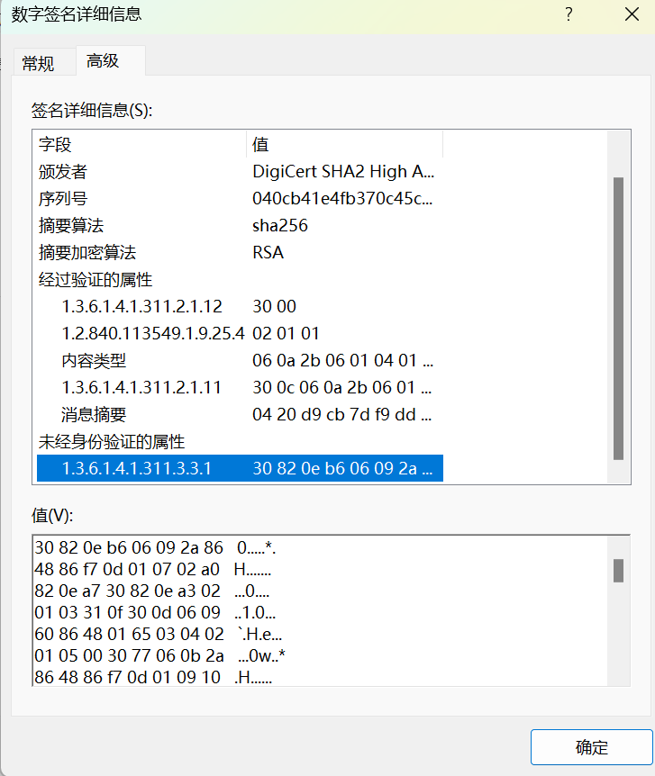
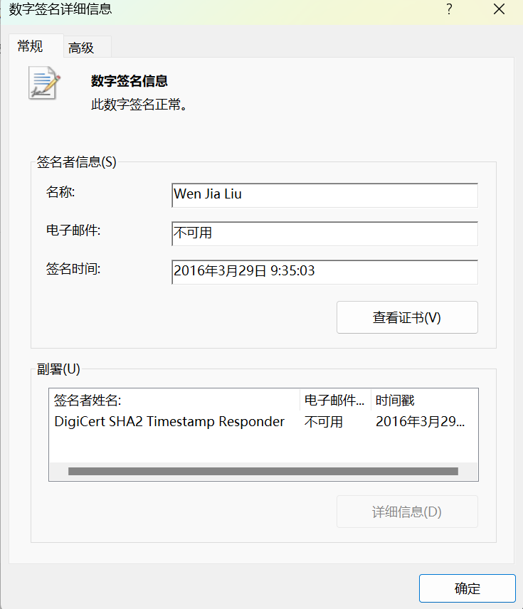
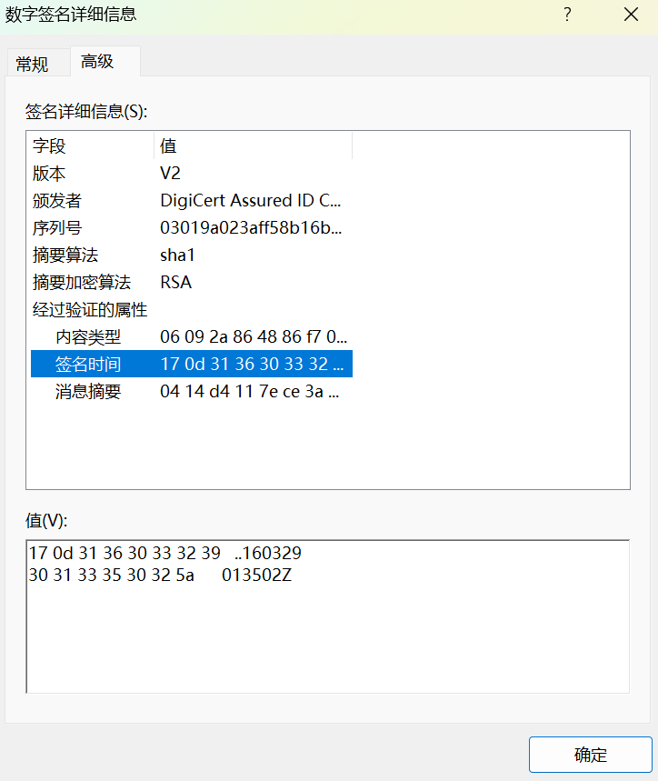

# windows_pe_signature_research

## 导出签名数据

具体的 PE 格式可以参考 [MSDN](https://learn.microsoft.com/en-us/windows/win32/debug/pe-format)。

签名证书的位置在 Certificate Table 里（也称为 Security Directory）：


可以从 Optional Header 的 Data Directories 里找到 Security Directory 的文件偏移：


如图表示，ProcessHacker.exe 文件的签名数据在 0x1A0400 位置，长度 0x3A20。

导航到这个偏移位置即可看到这里就是签名数据：


参考 [MSDN](https://learn.microsoft.com/en-us/windows/win32/api/wintrust/ns-wintrust-win_certificate)， 签名数据的结构如下：

```c
typedef struct _WIN_CERTIFICATE {
  DWORD dwLength;
  WORD  wRevision;
  WORD  wCertificateType;
  BYTE  bCertificate[ANYSIZE_ARRAY];
} WIN_CERTIFICATE, *LPWIN_CERTIFICATE;
```

所以，bCertificate 是实际的证书内容，wCertificateType 表示签名证书类型，根据这个字段可知支持三种证书类型：PKCS #1、PKCS #7、X509，我看到过的文件都是使用 PKCS #7 签名。

找到 Security Directory 偏移之后，跳过前面的 8 字节就是实际的 PKCS #7 证书内容，DER 格式，代码示意：

```rust
fn extract_pkcs7_from_pe(file: &PathBuf) -> Result<Vec<u8>, Box<dyn Error>> {
    // ...
    let image = VecPE::from_disk_file(file.to_str().unwrap())?;
    let security_directory =
        image.get_data_directory(exe::ImageDirectoryEntry::Security)?;
    let signature_data =
        exe::Buffer::offset_to_ptr(&image, security_directory.virtual_address.into())?; // security_data_directory rva is equivalent to file offset

    Ok(unsafe {
        let vec = std::slice::from_raw_parts(signature_data, security_directory.size as usize).to_vec();    // cloned
        vec.into_iter().skip(8).collect()   // _WIN_CERTIFICATE->bCertificate
    })
}
```

使用项目中的 pe-sign 工具可以直接导出：

```powershell
pe-sign extract <input_file> > pkcs7.cer
```

使用 `--pem` 参数可以将 DER 格式转换为 PEM 格式：

```powershell
pe-sign extract <input_file> --pem > pkcs7.pem
```

## 使用 openssl 解析证书

解析导出的证书，如果是 PEM 格式，`-inform DER` 改为 `-inform PEM`：

```powershell
openssl pkcs7 -inform DER -in .\pkcs7.cer -print_certs -text -noout
```

这里有个小疑问，从属性里看 ProcessHacker.exe 文件有两个签名，一个是 sha1,另一个是 sha256：


openssl 打印的证书信息只有 sha1 证书的，使用 `-print` 参数打印 pkcs7 结构也可以看到是有 sha256 证书内容的但是没正确解析：

<details>
<summary>-print 解析结果</summary>

```powershell
PS C:\dev\windows_pe_signature_research> openssl pkcs7 -inform DER -in .\pkcs7.cer -print -text -noout
PKCS7:
  type: pkcs7-signedData (1.2.840.113549.1.7.2)
  d.sign:
    version: 1
    md_algs:
        algorithm: sha1 (1.3.14.3.2.26)
        parameter: NULL
    contents:
      type: undefined (1.3.6.1.4.1.311.2.1.4)
      d.other: SEQUENCE:
    0:d=0  hl=2 l=  60 cons: SEQUENCE
    2:d=1  hl=2 l=  23 cons:  SEQUENCE
    4:d=2  hl=2 l=  10 prim:   OBJECT            :1.3.6.1.4.1.311.2.1.15
   16:d=2  hl=2 l=   9 cons:   SEQUENCE
   18:d=3  hl=2 l=   1 prim:    BIT STRING
   21:d=3  hl=2 l=   4 cons:    cont [ 0 ]
   23:d=4  hl=2 l=   2 cons:     cont [ 2 ]
   25:d=5  hl=2 l=   0 prim:      cont [ 0 ]
   27:d=1  hl=2 l=  33 cons:  SEQUENCE
   29:d=2  hl=2 l=   9 cons:   SEQUENCE
   31:d=3  hl=2 l=   5 prim:    OBJECT            :sha1
   38:d=3  hl=2 l=   0 prim:    NULL
   40:d=2  hl=2 l=  20 prim:   OCTET STRING      [HEX DUMP]:9253A6F72EE0E3970D5457E0F061FDB40B484F18
    cert:
        cert_info:
          version: 2
          serialNumber: 21194619115459756445373572871103017343
          signature:
            algorithm: sha1WithRSAEncryption (1.2.840.113549.1.1.5)
            parameter: NULL
          issuer: C=US, O=DigiCert Inc, OU=www.digicert.com, CN=DigiCert High Assurance Code Signing CA-1
          validity:
            notBefore: Oct 30 00:00:00 2013 GMT
            notAfter: Jan  4 12:00:00 2017 GMT
          subject: C=AU, ST=New South Wales, L=Sydney, O=Wen Jia Liu, CN=Wen Jia Liu
          key:           X509_PUBKEY:
            algor:
              algorithm: rsaEncryption (1.2.840.113549.1.1.1)
              parameter: NULL
            public_key:  (0 unused bits)
              0000 - 30 82 01 0a 02 82 01 01-00 cc 2e a1 52 49   0...........RI
              000e - 09 cc 22 ef 34 43 dc 41-a6 98 a0 1f 0f 69   ..".4C.A.....i
              001c - 1a 33 b2 92 a5 73 26 4e-1d b9 e2 ab c4 46   .3...s&N.....F
              002a - e1 3e f9 24 c2 f6 1c 00-7b dc 1c d9 ae 5a   .>.$....{....Z
              0038 - a9 e4 86 51 f2 c0 fb 2d-1a 94 cb be 13 a8   ...Q...-......
              0046 - c6 f7 83 63 1e 27 19 3f-95 36 bf 40 98 38   ...c.'.?.6.@.8
              0054 - 23 52 b2 f9 c7 e2 14 6e-fe 31 d5 6f c6 d1   #R.....n.1.o..
              0062 - 0f 0a 45 54 9c 7a 6c bf-b4 02 48 31 0a c2   ..ET.zl...H1..
              0070 - 6c ed 4a c1 69 1a 9b f7-3e 05 e3 01 99 4a   l.J.i...>....J
              007e - a9 0f 70 36 94 a3 ba e5-0f af 76 9c a2 4f   ..p6......v..O
              008c - a1 78 0e f0 a2 d5 f0 6d-9f 0c 33 4c c3 b9   .x.....m..3L..
              009a - a6 fb 0d b5 87 00 08 f1-38 6b 1f 1d b0 ee   ........8k....
              00a8 - e8 c4 8d 89 43 c9 08 10-2a 92 a3 87 ee 17   ....C...*.....
              00b6 - 27 24 a3 12 1b 11 bc 8c-15 9a 08 8a d7 3a   '$...........:
              00c4 - 5e ed 04 a0 e0 e6 ed ef-34 6d 2c 53 bf 90   ^.......4m,S..
              00d2 - 09 de 7d 59 1f 53 9c d4-b7 b9 19 72 16 95   ..}Y.S.....r..
              00e0 - 3d ff 79 70 ff 46 5e 9c-33 68 4a 06 d3 ec   =.yp.F^.3hJ...
              00ee - 6c b4 c7 a3 7d 8d 84 84-36 3c 12 d5 97 fb   l...}...6<....
              00fc - ec 4d 87 9d 73 c4 e2 af-2f 84 48 18 bb 02   .M..s.../.H...
              010a - 03 01 00 01                                 ....
          issuerUID: <ABSENT>
          subjectUID: <ABSENT>
          extensions:
              object: X509v3 Authority Key Identifier (2.5.29.35)
              critical: BOOL ABSENT
              value:
                0000 - 30 16 80 14 97 48 03 eb-15 08 6b b9 b2   0....H....k..
                000d - 58 23 cc 94 2e f1 c6 65-d2 64 8e         X#.....e.d.

              object: X509v3 Subject Key Identifier (2.5.29.14)
              critical: BOOL ABSENT
              value:
                0000 - 04 14 2c b8 9a 96 b2 c1-b1 a0 7d a4 90   ..,.......}..
                000d - 20 19 b8 be 05 58 df 2c-78                ....X.,x

              object: X509v3 Key Usage (2.5.29.15)
              critical: TRUE
              value:
                0000 - 03 02 07 80                              ....

              object: X509v3 Extended Key Usage (2.5.29.37)
              critical: BOOL ABSENT
              value:
                0000 - 30 0a 06 08 2b 06 01 05-05 07 03 03      0...+.......

              object: X509v3 CRL Distribution Points (2.5.29.31)
              critical: BOOL ABSENT
              value:
                0000 - 30 60 30 2e a0 2c a0 2a-86 28 68 74 74   0`0..,.*.(htt
                000d - 70 3a 2f 2f 63 72 6c 33-2e 64 69 67 69   p://crl3.digi
                001a - 63 65 72 74 2e 63 6f 6d-2f 68 61 2d 63   cert.com/ha-c
                0027 - 73 2d 32 30 31 31 61 2e-63 72 6c 30 2e   s-2011a.crl0.
                0034 - a0 2c a0 2a 86 28 68 74-74 70 3a 2f 2f   .,.*.(http://
                0041 - 63 72 6c 34 2e 64 69 67-69 63 65 72 74   crl4.digicert
                004e - 2e 63 6f 6d 2f 68 61 2d-63 73 2d 32 30   .com/ha-cs-20
                005b - 31 31 61 2e 63 72 6c                     11a.crl

              object: X509v3 Certificate Policies (2.5.29.32)
              critical: BOOL ABSENT
              value:
                0000 - 30 43 30 37 06 09 60 86-48 01 86 fd 6c   0C07..`.H...l
                000d - 03 01 30 2a 30 28 06 08-2b 06 01 05 05   ..0*0(..+....
                001a - 07 02 01 16 1c 68 74 74-70 73 3a 2f 2f   .....https://
                0027 - 77 77 77 2e 64 69 67 69-63 65 72 74 2e   www.digicert.
                0034 - 63 6f 6d 2f 43 50 53 30-08 06 06 67 81   com/CPS0...g.
                0041 - 0c 01 04 01                              ....

              object: Authority Information Access (1.3.6.1.5.5.7.1.1)
              critical: BOOL ABSENT
              value:
                0000 - 30 78 30 24 06 08 2b 06-01 05 05 07 30   0x0$..+.....0
                000d - 01 86 18 68 74 74 70 3a-2f 2f 6f 63 73   ...http://ocs
                001a - 70 2e 64 69 67 69 63 65-72 74 2e 63 6f   p.digicert.co
                0027 - 6d 30 50 06 08 2b 06 01-05 05 07 30 02   m0P..+.....0.
                0034 - 86 44 68 74 74 70 3a 2f-2f 63 61 63 65   .Dhttp://cace
                0041 - 72 74 73 2e 64 69 67 69-63 65 72 74 2e   rts.digicert.
                004e - 63 6f 6d 2f 44 69 67 69-43 65 72 74 48   com/DigiCertH
                005b - 69 67 68 41 73 73 75 72-61 6e 63 65 43   ighAssuranceC
                0068 - 6f 64 65 53 69 67 6e 69-6e 67 43 41 2d   odeSigningCA-
                0075 - 31 2e 63 72 74                           1.crt

              object: X509v3 Basic Constraints (2.5.29.19)
              critical: TRUE
              value:
                0000 - 30 00                                    0.
        sig_alg:
          algorithm: sha1WithRSAEncryption (1.2.840.113549.1.1.5)
          parameter: NULL
        signature:  (0 unused bits)
          0000 - 88 f1 59 8a 6a 8a 6c 49-04 64 67 70 02 14 76   ..Y.j.lI.dgp..v
          000f - 57 3d 57 c2 f9 cb 88 78-6e 82 3a 63 12 f7 c9   W=W....xn.:c...
          001e - 0b 57 8b 13 16 b0 69 d7-67 0f 8c 5a 59 38 6a   .W....i.g..ZY8j
          002d - a7 2d ef ed eb 41 87 b9-e5 81 99 c3 c2 c8 05   .-...A.........
          003c - b0 56 62 20 22 c2 94 ac-38 e1 4d 5e 66 a7 a7   .Vb "...8.M^f..
          004b - 7a 45 24 b8 93 fa c2 45-34 11 55 ab f3 01 ae   zE$....E4.U....
          005a - 41 c9 19 18 70 5d 4c 9c-29 1e 67 1c ea 6b 9c   A...p]L.).g..k.
          0069 - 77 db ed e8 53 79 86 6e-a9 35 dd da 4f 28 e2   w...Sy.n.5..O(.
          0078 - 95 4a 30 25 1d 1e 06 96-bd 21 c9 48 de 0d 42   .J0%.....!.H..B
          0087 - 01 48 7f b7 b3 5f aa 30-8b 78 cf c8 1a 7d 51   .H..._.0.x...}Q
          0096 - 97 9a 5c 0d 1f e4 1f c5-5c dd ff d0 03 9e 6c   ..\.....\.....l
          00a5 - f4 9b 49 7c be 7d c1 5d-49 2d a0 07 90 6a cc   ..I|.}.]I-...j.
          00b4 - f1 4a 60 1e 18 14 33 40-45 b4 51 98 65 0b 31   .J`...3@E.Q.e.1
          00c3 - 7d 09 65 31 82 dd 78 da-cc ef 49 64 c4 57 cf   }.e1..x...Id.W.
          00d2 - 6d 15 a7 b7 9f bf 0b 73-2a e0 ac 45 cf ba 62   m......s*..E..b
          00e1 - 7a fb 62 2d fe 9d c1 80-64 c2 14 11 f0 46 4e   z.b-....d....FN
          00f0 - de 14 5b e8 2d b7 c5 12-44 88 04 45 47 eb 20   ..[.-...D..EG.
          00ff - 22                                             "

        cert_info:
          version: 2
          serialNumber: 3995999952007395326848486153846780006
          signature:
            algorithm: sha1WithRSAEncryption (1.2.840.113549.1.1.5)
            parameter: NULL
          issuer: C=US, O=DigiCert Inc, OU=www.digicert.com, CN=DigiCert Assured ID CA-1
          validity:
            notBefore: Oct 22 00:00:00 2014 GMT
            notAfter: Oct 22 00:00:00 2024 GMT
          subject: C=US, O=DigiCert, CN=DigiCert Timestamp Responder
          key:           X509_PUBKEY:
            algor:
              algorithm: rsaEncryption (1.2.840.113549.1.1.1)
              parameter: NULL
            public_key:  (0 unused bits)
              0000 - 30 82 01 0a 02 82 01 01-00 a3 64 5d fc 7c   0.........d].|
              000e - b3 e0 82 35 e0 e0 f6 c6-2a e6 49 75 3b cc   ...5....*.Iu;.
              001c - 6e e0 53 a9 9f 1f 64 59-e6 7c 6b 7f 6b 8c   n.S...dY.|k.k.
              002a - 9d 55 f8 92 e3 9e d5 5a-63 5b 02 49 50 d9   .U.....Zc[.IP.
              0038 - 83 ce 6f 66 ee dd cb 85-e9 5f a5 f9 d4 87   ..of....._....
              0046 - 74 88 44 3b 19 c9 e5 f5-91 9f c6 14 39 ac   t.D;........9.
              0054 - 24 ea a8 4b 2c 91 89 cc-5e 28 f4 64 b6 50   $..K,...^(.d.P
              0062 - b7 f5 12 b3 73 96 0a 67-a3 be 61 9f ae f3   ....s..g..a...
              0070 - fd 12 78 75 0e a6 5b 14-fd 45 23 8e 86 44   ..xu..[..E#..D
              007e - 55 7d 18 86 05 8c 55 87-79 48 46 f7 ca 0e   U}....U.yHF...
              008c - 8d a7 de 4e 5f e2 a8 b6-2d 59 02 61 88 61   ...N_...-Y.a.a
              009a - 72 18 68 b9 b8 7c ee e6-e7 34 2f 31 77 81   r.h..|...4/1w.
              00a8 - 30 1f bb 36 01 8d ef 27-e3 f7 9a f0 4c 31   0..6...'....L1
              00b6 - 64 8d e3 eb fa 19 87 a8-7e cf ec 8c 0c 36   d.......~....6
              00c4 - 5b 7a c1 7a b8 78 c7 c9-06 2e 46 10 c8 8d   [z.z.x....F...
              00d2 - e8 04 60 db bc 73 74 fa-4e d8 fe aa 40 f1   ..`..st.N...@.
              00e0 - b2 ce 70 46 83 e9 da 40-a1 59 3a d9 15 09   ..pF...@.Y:...
              00ee - 57 99 56 30 93 f3 c9 61-cc d0 08 cc 6b ec   W.V0...a....k.
              00fc - 62 42 91 ac 02 c0 ef a4-f0 89 11 8f 77 02   bB..........w.
              010a - 03 01 00 01                                 ....
          issuerUID: <ABSENT>
          subjectUID: <ABSENT>
          extensions:
              object: X509v3 Key Usage (2.5.29.15)
              critical: TRUE
              value:
                0000 - 03 02 07 80                              ....

              object: X509v3 Basic Constraints (2.5.29.19)
              critical: TRUE
              value:
                0000 - 30 00                                    0.

              object: X509v3 Extended Key Usage (2.5.29.37)
              critical: TRUE
              value:
                0000 - 30 0a 06 08 2b 06 01 05-05 07 03 08      0...+.......

              object: X509v3 Certificate Policies (2.5.29.32)
              critical: BOOL ABSENT
              value:
                0000 - 30 82 01 b2 30 82 01 a1-06 09 60 86 48   0...0.....`.H
                000d - 01 86 fd 6c 07 01 30 82-01 92 30 28 06   ...l..0...0(.
                001a - 08 2b 06 01 05 05 07 02-01 16 1c 68 74   .+.........ht
                0027 - 74 70 73 3a 2f 2f 77 77-77 2e 64 69 67   tps://www.dig
                0034 - 69 63 65 72 74 2e 63 6f-6d 2f 43 50 53   icert.com/CPS
                0041 - 30 82 01 64 06 08 2b 06-01 05 05 07 02   0..d..+......
                004e - 02 30 82 01 56 1e 82 01-52 00 41 00 6e   .0..V...R.A.n
                005b - 00 79 00 20 00 75 00 73-00 65 00 20 00   .y. .u.s.e. .
                0068 - 6f 00 66 00 20 00 74 00-68 00 69 00 73   o.f. .t.h.i.s
                0075 - 00 20 00 43 00 65 00 72-00 74 00 69 00   . .C.e.r.t.i.
                0082 - 66 00 69 00 63 00 61 00-74 00 65 00 20   f.i.c.a.t.e.
                008f - 00 63 00 6f 00 6e 00 73-00 74 00 69 00   .c.o.n.s.t.i.
                009c - 74 00 75 00 74 00 65 00-73 00 20 00 61   t.u.t.e.s. .a
                00a9 - 00 63 00 63 00 65 00 70-00 74 00 61 00   .c.c.e.p.t.a.
                00b6 - 6e 00 63 00 65 00 20 00-6f 00 66 00 20   n.c.e. .o.f.
                00c3 - 00 74 00 68 00 65 00 20-00 44 00 69 00   .t.h.e. .D.i.
                00d0 - 67 00 69 00 43 00 65 00-72 00 74 00 20   g.i.C.e.r.t.
                00dd - 00 43 00 50 00 2f 00 43-00 50 00 53 00   .C.P./.C.P.S.
                00ea - 20 00 61 00 6e 00 64 00-20 00 74 00 68    .a.n.d. .t.h
                00f7 - 00 65 00 20 00 52 00 65-00 6c 00 79 00   .e. .R.e.l.y.
                0104 - 69 00 6e 00 67 00 20 00-50 00 61 00 72   i.n.g. .P.a.r
                0111 - 00 74 00 79 00 20 00 41-00 67 00 72 00   .t.y. .A.g.r.
                011e - 65 00 65 00 6d 00 65 00-6e 00 74 00 20   e.e.m.e.n.t.
                012b - 00 77 00 68 00 69 00 63-00 68 00 20 00   .w.h.i.c.h. .
                0138 - 6c 00 69 00 6d 00 69 00-74 00 20 00 6c   l.i.m.i.t. .l
                0145 - 00 69 00 61 00 62 00 69-00 6c 00 69 00   .i.a.b.i.l.i.
                0152 - 74 00 79 00 20 00 61 00-6e 00 64 00 20   t.y. .a.n.d.
                015f - 00 61 00 72 00 65 00 20-00 69 00 6e 00   .a.r.e. .i.n.
                016c - 63 00 6f 00 72 00 70 00-6f 00 72 00 61   c.o.r.p.o.r.a
                0179 - 00 74 00 65 00 64 00 20-00 68 00 65 00   .t.e.d. .h.e.
                0186 - 72 00 65 00 69 00 6e 00-20 00 62 00 79   r.e.i.n. .b.y
                0193 - 00 20 00 72 00 65 00 66-00 65 00 72 00   . .r.e.f.e.r.
                01a0 - 65 00 6e 00 63 00 65 00-2e 30 0b 06 09   e.n.c.e..0...
                01ad - 60 86 48 01 86 fd 6c 03-15               `.H...l..

              object: X509v3 Authority Key Identifier (2.5.29.35)
              critical: BOOL ABSENT
              value:
                0000 - 30 16 80 14 15 00 12 2b-13 98 b2 99 07   0......+.....
                000d - ed 1e df a2 be 57 0d 2b-67 02 cd         .....W.+g..

              object: X509v3 Subject Key Identifier (2.5.29.14)
              critical: BOOL ABSENT
              value:
                0000 - 04 14 61 5a 4d 24 b6 49-32 9d 4a 2a 79   ..aZM$.I2.J*y
                000d - 1a 83 4b f4 1e 89 c1 ca-7d               ..K.....}

              object: X509v3 CRL Distribution Points (2.5.29.31)
              critical: BOOL ABSENT
              value:
                0000 - 30 74 30 38 a0 36 a0 34-86 32 68 74 74   0t08.6.4.2htt
                000d - 70 3a 2f 2f 63 72 6c 33-2e 64 69 67 69   p://crl3.digi
                001a - 63 65 72 74 2e 63 6f 6d-2f 44 69 67 69   cert.com/Digi
                0027 - 43 65 72 74 41 73 73 75-72 65 64 49 44   CertAssuredID
                0034 - 43 41 2d 31 2e 63 72 6c-30 38 a0 36 a0   CA-1.crl08.6.
                0041 - 34 86 32 68 74 74 70 3a-2f 2f 63 72 6c   4.2http://crl
                004e - 34 2e 64 69 67 69 63 65-72 74 2e 63 6f   4.digicert.co
                005b - 6d 2f 44 69 67 69 43 65-72 74 41 73 73   m/DigiCertAss
                0068 - 75 72 65 64 49 44 43 41-2d 31 2e 63 72   uredIDCA-1.cr
                0075 - 6c                                       l

              object: Authority Information Access (1.3.6.1.5.5.7.1.1)
              critical: BOOL ABSENT
              value:
                0000 - 30 69 30 24 06 08 2b 06-01 05 05 07 30   0i0$..+.....0
                000d - 01 86 18 68 74 74 70 3a-2f 2f 6f 63 73   ...http://ocs
                001a - 70 2e 64 69 67 69 63 65-72 74 2e 63 6f   p.digicert.co
                0027 - 6d 30 41 06 08 2b 06 01-05 05 07 30 02   m0A..+.....0.
                0034 - 86 35 68 74 74 70 3a 2f-2f 63 61 63 65   .5http://cace
                0041 - 72 74 73 2e 64 69 67 69-63 65 72 74 2e   rts.digicert.
                004e - 63 6f 6d 2f 44 69 67 69-43 65 72 74 41   com/DigiCertA
                005b - 73 73 75 72 65 64 49 44-43 41 2d 31 2e   ssuredIDCA-1.
                0068 - 63 72 74                                 crt
        sig_alg:
          algorithm: sha1WithRSAEncryption (1.2.840.113549.1.1.5)
          parameter: NULL
        signature:  (0 unused bits)
          0000 - 9d 25 7e 1b 33 4d b2 26-81 5c 9b 86 ce 23 20   .%~.3M.&.\...#
          000f - 0f 80 87 e5 88 ff ff b1-d4 6a 2c 31 ed 3a 17   .........j,1.:.
          001e - 19 71 17 cd a9 1b bc 5a-16 39 00 9d e3 6c 84   .q.....Z.9...l.
          002d - e4 5a 40 fb de 06 01 8c-37 fa 9b b1 9d 24 7e   .Z@.....7....$~
          003c - fe 20 a4 57 ad 5b b7 9a-b0 60 26 ea 69 57 21   . .W.[...`&.iW!
          004b - 5d 34 2f 1f 71 b0 83 94-19 05 6b 35 90 10 a0   ]4/.q.....k5...
          005a - 7b 97 c7 f6 3f e7 e2 11-41 a6 bd 62 d9 f0 27   {...?...A..b..'
          0069 - 3d 38 1d 28 6f 3a 52 09-f0 ec 70 62 d3 62 4b   =8.(o:R...pb.bK
          0078 - b0 e0 73 a6 92 c0 d3 8e-31 d8 2f e3 6d 17 13   ..s.....1./.m..
          0087 - 06 ee e4 03 b6 14 ab f3-8f 43 a7 71 9d 21 dd   .........C.q.!.
          0096 - 14 ca 15 5d 92 41 da f9-0f 81 d1 99 74 0d 26   ...].A......t.&
          00a5 - c4 0e 7f 1b b5 f5 a0 f1-c6 77 06 28 15 e9 d8   .........w.(...
          00b4 - 93 e5 55 16 f0 bb 0a ab-1c db 5c 48 27 66 c8   ..U.......\H'f.
          00c3 - a3 8b 0a 1c e5 95 da ae-c4 2e 59 a0 61 dd da   ..........Y.a..
          00d2 - f3 6d a2 61 e9 8a 0b 6d-ec 12 18 bd f7 55 54   .m.a...m.....UT
          00e1 - 40 03 92 2b 6b c2 51 c2-0a 48 af b0 d4 6e e0   @..+k.Q..H...n.
          00f0 - f4 14 0a 3a 1b e3 8f 3d-ca af 6a 8d 7b dc d8   ...:...=..j.{..
          00ff - 44                                             D

        cert_info:
          version: 2
          serialNumber: 3680403385497920146360574967411527007
          signature:
            algorithm: sha1WithRSAEncryption (1.2.840.113549.1.1.5)
            parameter: NULL
          issuer: C=US, O=DigiCert Inc, OU=www.digicert.com, CN=DigiCert High Assurance EV Root CA
          validity:
            notBefore: Feb 11 12:00:00 2011 GMT
            notAfter: Feb 10 12:00:00 2026 GMT
          subject: C=US, O=DigiCert Inc, OU=www.digicert.com, CN=DigiCert High Assurance Code Signing CA-1
          key:           X509_PUBKEY:
            algor:
              algorithm: rsaEncryption (1.2.840.113549.1.1.1)
              parameter: NULL
            public_key:  (0 unused bits)
              0000 - 30 82 01 0a 02 82 01 01-00 c5 f9 23 e6 94   0..........#..
              000e - 27 c4 80 14 a4 80 32 5f-40 a3 8d 6f 70 c0   '.....2_@..op.
              001c - e5 36 71 71 3a 75 a4 aa-1a 92 94 89 5e ac   .6qq:u......^.
              002a - 23 71 cb 4e 67 7d 41 3f-aa e3 4b b7 7b be   #q.Ng}A?..K.{.
              0038 - 9d c1 a8 38 8f 69 2f 3a-24 e9 77 59 12 c7   ...8.i/:$.wY..
              0046 - 66 04 43 c2 0d 26 82 89-40 19 f2 2c ea e7   f.C..&..@..,..
              0054 - 4c e7 7c 05 1a b8 ff 88-09 4f 26 37 ef 3a   L.|......O&7.:
              0062 - a4 fa 22 6c 88 c9 4a 1b-61 f2 ae 10 5e 6f   .."l..J.a...^o
              0070 - bc d1 79 9b 59 18 60 e5-ee 29 b5 03 2a a4   ..y.Y.`..)..*.
              007e - ce f1 83 19 4f 69 05 73-28 09 fb 22 10 93   ....Oi.s(.."..
              008c - 22 a0 90 19 1a 4c 31 f2-d3 2b d8 84 43 af   "....L1..+..C.
              009a - 3c 63 ff 98 db 20 d2 09-2b 54 c1 ea fd 6a   <c... ..+T...j
              00a8 - 83 e7 10 a3 12 71 f5 d6-d7 e1 12 7a d5 e0   .....q.....z..
              00b6 - 56 5a ce ea 01 5b 68 65-5b c1 3f 58 52 33   VZ...[he[.?XR3
              00c4 - a9 35 61 4e 22 cb 81 ca-36 a3 12 cb 06 d6   .5aN"...6.....
              00d2 - cf 1b 4d 18 7e b9 92 b9-12 cf 40 26 d8 9a   ..M.~.....@&..
              00e0 - 36 85 b3 15 aa 47 93 84-6b 07 bb bc d5 b3   6....G..k.....
              00ee - de 25 00 11 89 00 68 c1-29 3c ea 3e 2d ee   .%....h.)<.>-.
              00fc - 50 ab d7 1c 30 06 78 3c-a5 10 23 67 91 02   P...0.x<..#g..
              010a - 03 01 00 01                                 ....
          issuerUID: <ABSENT>
          subjectUID: <ABSENT>
          extensions:
              object: X509v3 Key Usage (2.5.29.15)
              critical: TRUE
              value:
                0000 - 03 02 01 86                              ....

              object: X509v3 Extended Key Usage (2.5.29.37)
              critical: BOOL ABSENT
              value:
                0000 - 30 0a 06 08 2b 06 01 05-05 07 03 03      0...+.......

              object: X509v3 Certificate Policies (2.5.29.32)
              critical: BOOL ABSENT
              value:
                0000 - 30 82 01 b6 30 82 01 b2-06 08 60 86 48   0...0.....`.H
                000d - 01 86 fd 6c 03 30 82 01-a4 30 3a 06 08   ...l.0...0:..
                001a - 2b 06 01 05 05 07 02 01-16 2e 68 74 74   +.........htt
                0027 - 70 3a 2f 2f 77 77 77 2e-64 69 67 69 63   p://www.digic
                0034 - 65 72 74 2e 63 6f 6d 2f-73 73 6c 2d 63   ert.com/ssl-c
                0041 - 70 73 2d 72 65 70 6f 73-69 74 6f 72 79   ps-repository
                004e - 2e 68 74 6d 30 82 01 64-06 08 2b 06 01   .htm0..d..+..
                005b - 05 05 07 02 02 30 82 01-56 1e 82 01 52   .....0..V...R
                0068 - 00 41 00 6e 00 79 00 20-00 75 00 73 00   .A.n.y. .u.s.
                0075 - 65 00 20 00 6f 00 66 00-20 00 74 00 68   e. .o.f. .t.h
                0082 - 00 69 00 73 00 20 00 43-00 65 00 72 00   .i.s. .C.e.r.
                008f - 74 00 69 00 66 00 69 00-63 00 61 00 74   t.i.f.i.c.a.t
                009c - 00 65 00 20 00 63 00 6f-00 6e 00 73 00   .e. .c.o.n.s.
                00a9 - 74 00 69 00 74 00 75 00-74 00 65 00 73   t.i.t.u.t.e.s
                00b6 - 00 20 00 61 00 63 00 63-00 65 00 70 00   . .a.c.c.e.p.
                00c3 - 74 00 61 00 6e 00 63 00-65 00 20 00 6f   t.a.n.c.e. .o
                00d0 - 00 66 00 20 00 74 00 68-00 65 00 20 00   .f. .t.h.e. .
                00dd - 44 00 69 00 67 00 69 00-43 00 65 00 72   D.i.g.i.C.e.r
                00ea - 00 74 00 20 00 43 00 50-00 2f 00 43 00   .t. .C.P./.C.
                00f7 - 50 00 53 00 20 00 61 00-6e 00 64 00 20   P.S. .a.n.d.
                0104 - 00 74 00 68 00 65 00 20-00 52 00 65 00   .t.h.e. .R.e.
                0111 - 6c 00 79 00 69 00 6e 00-67 00 20 00 50   l.y.i.n.g. .P
                011e - 00 61 00 72 00 74 00 79-00 20 00 41 00   .a.r.t.y. .A.
                012b - 67 00 72 00 65 00 65 00-6d 00 65 00 6e   g.r.e.e.m.e.n
                0138 - 00 74 00 20 00 77 00 68-00 69 00 63 00   .t. .w.h.i.c.
                0145 - 68 00 20 00 6c 00 69 00-6d 00 69 00 74   h. .l.i.m.i.t
                0152 - 00 20 00 6c 00 69 00 61-00 62 00 69 00   . .l.i.a.b.i.
                015f - 6c 00 69 00 74 00 79 00-20 00 61 00 6e   l.i.t.y. .a.n
                016c - 00 64 00 20 00 61 00 72-00 65 00 20 00   .d. .a.r.e. .
                0179 - 69 00 6e 00 63 00 6f 00-72 00 70 00 6f   i.n.c.o.r.p.o
                0186 - 00 72 00 61 00 74 00 65-00 64 00 20 00   .r.a.t.e.d. .
                0193 - 68 00 65 00 72 00 65 00-69 00 6e 00 20   h.e.r.e.i.n.
                01a0 - 00 62 00 79 00 20 00 72-00 65 00 66 00   .b.y. .r.e.f.
                01ad - 65 00 72 00 65 00 6e 00-63 00 65 00 2e   e.r.e.n.c.e..

              object: X509v3 Basic Constraints (2.5.29.19)
              critical: TRUE
              value:
                0000 - 30 06 01 01 ff 02 01 00-                 0.......

              object: Authority Information Access (1.3.6.1.5.5.7.1.1)
              critical: BOOL ABSENT
              value:
                0000 - 30 71 30 24 06 08 2b 06-01 05 05 07 30   0q0$..+.....0
                000d - 01 86 18 68 74 74 70 3a-2f 2f 6f 63 73   ...http://ocs
                001a - 70 2e 64 69 67 69 63 65-72 74 2e 63 6f   p.digicert.co
                0027 - 6d 30 49 06 08 2b 06 01-05 05 07 30 02   m0I..+.....0.
                0034 - 86 3d 68 74 74 70 3a 2f-2f 63 61 63 65   .=http://cace
                0041 - 72 74 73 2e 64 69 67 69-63 65 72 74 2e   rts.digicert.
                004e - 63 6f 6d 2f 44 69 67 69-43 65 72 74 48   com/DigiCertH
                005b - 69 67 68 41 73 73 75 72-61 6e 63 65 45   ighAssuranceE
                0068 - 56 52 6f 6f 74 43 41 2e-63 72 74         VRootCA.crt

              object: X509v3 CRL Distribution Points (2.5.29.31)
              critical: BOOL ABSENT
              value:
                0000 - 30 81 84 30 40 a0 3e a0-3c 86 3a 68 74   0..0@.>.<.:ht
                000d - 74 70 3a 2f 2f 63 72 6c-33 2e 64 69 67   tp://crl3.dig
                001a - 69 63 65 72 74 2e 63 6f-6d 2f 44 69 67   icert.com/Dig
                0027 - 69 43 65 72 74 48 69 67-68 41 73 73 75   iCertHighAssu
                0034 - 72 61 6e 63 65 45 56 52-6f 6f 74 43 41   ranceEVRootCA
                0041 - 2e 63 72 6c 30 40 a0 3e-a0 3c 86 3a 68   .crl0@.>.<.:h
                004e - 74 74 70 3a 2f 2f 63 72-6c 34 2e 64 69   ttp://crl4.di
                005b - 67 69 63 65 72 74 2e 63-6f 6d 2f 44 69   gicert.com/Di
                0068 - 67 69 43 65 72 74 48 69-67 68 41 73 73   giCertHighAss
                0075 - 75 72 61 6e 63 65 45 56-52 6f 6f 74 43   uranceEVRootC
                0082 - 41 2e 63 72 6c                           A.crl

              object: X509v3 Subject Key Identifier (2.5.29.14)
              critical: BOOL ABSENT
              value:
                0000 - 04 14 97 48 03 eb 15 08-6b b9 b2 58 23   ...H....k..X#
                000d - cc 94 2e f1 c6 65 d2 64-8e               .....e.d.

              object: X509v3 Authority Key Identifier (2.5.29.35)
              critical: BOOL ABSENT
              value:
                0000 - 30 16 80 14 b1 3e c3 69-03 f8 bf 47 01   0....>.i...G.
                000d - d4 98 26 1a 08 02 ef 63-64 2b c3         ..&....cd+.
        sig_alg:
          algorithm: sha1WithRSAEncryption (1.2.840.113549.1.1.5)
          parameter: NULL
        signature:  (0 unused bits)
          0000 - 49 eb 7c 60 be ae ef c9-7c b3 c5 ba 4b 64 df   I.|`....|...Kd.
          000f - 16 69 e2 86 fa 29 d9 de-98 85 7d 40 66 26 33   .i...)....}@f&3
          001e - 2f 44 55 aa aa 90 e9 35-70 0a 34 be d3 ae 54   /DU....5p.4...T
          002d - 2e 8e 65 00 d6 7a 32 20-3e 6c 26 b8 98 a9 39   ..e..z2 >l&...9
          003c - b1 bc 95 c7 aa e9 f5 ee-46 66 c6 b3 e8 12 f8   ........Ff.....
          004b - b3 97 9d ff 74 58 82 34-99 75 50 ac 44 8f e8   ....tX.4.uP.D..
          005a - 92 ce 7d 8b 0f 31 96 c7-dc d3 11 30 98 74 16   ..}..1.....0.t.
          0069 - c6 e5 6b 45 76 a3 94 01-cd 33 00 7a 48 f6 6f   ..kEv....3.zH.o
          0078 - 86 31 c9 56 2b 33 22 d5-f8 01 b6 44 ce 8c b4   .1.V+3"....D...
          0087 - ca 88 d2 e4 16 e3 e7 f6-e2 3e e1 09 c0 9d 79   .........>....y
          0096 - 43 43 7f 55 5c 05 ad 93-10 c6 2c 0d 6b c0 9e   CC.U\.....,.k..
          00a5 - ea 78 e5 d2 77 d6 b8 da-9a 98 7f ba 4c 92 2b   .x..w.......L.+
          00b4 - 9d bd a4 88 b1 dd af c3-4c d2 97 9b 03 c6 ae   ........L......
          00c3 - 5f 1b 44 0f 33 37 15 e3-cb ff 2f 56 d3 16 a4   _.D.37..../V...
          00d2 - 5b 55 67 9d a2 ca db 34-6c 0c 73 4a b5 7b a4   [Ug....4l.sJ.{.
          00e1 - b6 b3 e9 35 02 78 70 ec-00 7a cb fc 4b 4f 22   ...5.xp..z..KO"
          00f0 - 36 bb 14 84 c9 8f 91 dd-0f 3c 75 8c ca 0b 88   6........<u....
          00ff - e7                                             .

        cert_info:
          version: 2
          serialNumber: 9294069684021802972772960878324333083
          signature:
            algorithm: sha1WithRSAEncryption (1.2.840.113549.1.1.5)
            parameter: NULL
          issuer: C=US, O=DigiCert Inc, OU=www.digicert.com, CN=DigiCert Assured ID Root CA
          validity:
            notBefore: Nov 10 00:00:00 2006 GMT
            notAfter: Nov 10 00:00:00 2021 GMT
          subject: C=US, O=DigiCert Inc, OU=www.digicert.com, CN=DigiCert Assured ID CA-1
          key:           X509_PUBKEY:
            algor:
              algorithm: rsaEncryption (1.2.840.113549.1.1.1)
              parameter: NULL
            public_key:  (0 unused bits)
              0000 - 30 82 01 0a 02 82 01 01-00 e8 82 2d 99 f9   0..........-..
              000e - ca c2 42 95 a5 80 73 40-70 d2 9e 56 54 5c   ..B...s@p..VT\
              001c - a9 c4 d2 41 06 8f c9 33-fc 4d 45 91 5c 81   ...A...3.ME.\.
              002a - 9f ed 2c 9c f8 16 59 df-9e b5 24 15 c2 98   ..,...Y...$...
              0038 - b9 b4 77 49 dc 89 c4 0a-da af cb 5e 6b ed   ..wI.......^k.
              0046 - ad b0 71 31 eb cf 3a 40-0c 46 4d 93 ec 8b   ..q1..:@.FM...
              0054 - 7a 36 08 03 ab 0c 34 fe-18 49 82 fe c7 c7   z6....4..I....
              0062 - 31 48 80 7c 1e a2 0f 92-0e 50 c9 c6 87 eb   1H.|.....P....
              0070 - 36 3f d8 30 c3 ff a6 f7-fb a2 cd 6f 73 23   6?.0.......os#
              007e - fe ac 56 05 90 f0 32 21-16 89 c6 70 88 f9   ..V...2!...p..
              008c - 05 97 7d a3 c7 43 dd 02-e8 3b 3d ed b1 41   ..}..C...;=..A
              009a - a3 ed 3f be db 95 48 c4-ee 1e b3 f2 bc 0c   ..?...H.......
              00a8 - 2b 99 d0 c6 5d 12 42 81-e1 83 6e 82 73 3f   +...].B...n.s?
              00b6 - 26 4b 14 90 ae 59 66 0a-c4 8d be d2 ce 06   &K...Yf.......
              00c4 - ae ad 84 6f 48 84 9b 4f-40 b9 f1 4c f2 af   ...oH..O@..L..
              00d2 - 98 fb f6 ce 40 5d 5c f6-a8 f1 2f af ec 89   ....@]\.../...
              00e0 - 22 f2 6b 18 65 b1 c1 73-ad d7 f1 d8 cf 1e   ".k.e..s......
              00ee - 0a 74 5c 42 b8 68 7e b7-d5 77 0a 27 56 7c   .t\B.h~..w.'V|
              00fc - 0f 62 a4 3f 32 14 60 95-fd 07 04 a2 09 02   .b.?2.`.......
              010a - 03 01 00 01                                 ....
          issuerUID: <ABSENT>
          subjectUID: <ABSENT>
          extensions:
              object: X509v3 Key Usage (2.5.29.15)
              critical: TRUE
              value:
                0000 - 03 02 01 86                              ....

              object: X509v3 Extended Key Usage (2.5.29.37)
              critical: BOOL ABSENT
              value:
                0000 - 30 32 06 08 2b 06 01 05-05 07 03 01 06   02..+........
                000d - 08 2b 06 01 05 05 07 03-02 06 08 2b 06   .+.........+.
                001a - 01 05 05 07 03 03 06 08-2b 06 01 05 05   ........+....
                0027 - 07 03 04 06 08 2b 06 01-05 05 07 03 08   .....+.......

              object: X509v3 Certificate Policies (2.5.29.32)
              critical: BOOL ABSENT
              value:
                0000 - 30 82 01 c5 30 82 01 b4-06 0a 60 86 48   0...0.....`.H
                000d - 01 86 fd 6c 00 01 04 30-82 01 a4 30 3a   ...l...0...0:
                001a - 06 08 2b 06 01 05 05 07-02 01 16 2e 68   ..+.........h
                0027 - 74 74 70 3a 2f 2f 77 77-77 2e 64 69 67   ttp://www.dig
                0034 - 69 63 65 72 74 2e 63 6f-6d 2f 73 73 6c   icert.com/ssl
                0041 - 2d 63 70 73 2d 72 65 70-6f 73 69 74 6f   -cps-reposito
                004e - 72 79 2e 68 74 6d 30 82-01 64 06 08 2b   ry.htm0..d..+
                005b - 06 01 05 05 07 02 02 30-82 01 56 1e 82   .......0..V..
                0068 - 01 52 00 41 00 6e 00 79-00 20 00 75 00   .R.A.n.y. .u.
                0075 - 73 00 65 00 20 00 6f 00-66 00 20 00 74   s.e. .o.f. .t
                0082 - 00 68 00 69 00 73 00 20-00 43 00 65 00   .h.i.s. .C.e.
                008f - 72 00 74 00 69 00 66 00-69 00 63 00 61   r.t.i.f.i.c.a
                009c - 00 74 00 65 00 20 00 63-00 6f 00 6e 00   .t.e. .c.o.n.
                00a9 - 73 00 74 00 69 00 74 00-75 00 74 00 65   s.t.i.t.u.t.e
                00b6 - 00 73 00 20 00 61 00 63-00 63 00 65 00   .s. .a.c.c.e.
                00c3 - 70 00 74 00 61 00 6e 00-63 00 65 00 20   p.t.a.n.c.e.
                00d0 - 00 6f 00 66 00 20 00 74-00 68 00 65 00   .o.f. .t.h.e.
                00dd - 20 00 44 00 69 00 67 00-69 00 43 00 65    .D.i.g.i.C.e
                00ea - 00 72 00 74 00 20 00 43-00 50 00 2f 00   .r.t. .C.P./.
                00f7 - 43 00 50 00 53 00 20 00-61 00 6e 00 64   C.P.S. .a.n.d
                0104 - 00 20 00 74 00 68 00 65-00 20 00 52 00   . .t.h.e. .R.
                0111 - 65 00 6c 00 79 00 69 00-6e 00 67 00 20   e.l.y.i.n.g.
                011e - 00 50 00 61 00 72 00 74-00 79 00 20 00   .P.a.r.t.y. .
                012b - 41 00 67 00 72 00 65 00-65 00 6d 00 65   A.g.r.e.e.m.e
                0138 - 00 6e 00 74 00 20 00 77-00 68 00 69 00   .n.t. .w.h.i.
                0145 - 63 00 68 00 20 00 6c 00-69 00 6d 00 69   c.h. .l.i.m.i
                0152 - 00 74 00 20 00 6c 00 69-00 61 00 62 00   .t. .l.i.a.b.
                015f - 69 00 6c 00 69 00 74 00-79 00 20 00 61   i.l.i.t.y. .a
                016c - 00 6e 00 64 00 20 00 61-00 72 00 65 00   .n.d. .a.r.e.
                0179 - 20 00 69 00 6e 00 63 00-6f 00 72 00 70    .i.n.c.o.r.p
                0186 - 00 6f 00 72 00 61 00 74-00 65 00 64 00   .o.r.a.t.e.d.
                0193 - 20 00 68 00 65 00 72 00-65 00 69 00 6e    .h.e.r.e.i.n
                01a0 - 00 20 00 62 00 79 00 20-00 72 00 65 00   . .b.y. .r.e.
                01ad - 66 00 65 00 72 00 65 00-6e 00 63 00 65   f.e.r.e.n.c.e
                01ba - 00 2e 30 0b 06 09 60 86-48 01 86 fd 6c   ..0...`.H...l
                01c7 - 03 15                                    ..

              object: X509v3 Basic Constraints (2.5.29.19)
              critical: TRUE
              value:
                0000 - 30 06 01 01 ff 02 01 00-                 0.......

              object: Authority Information Access (1.3.6.1.5.5.7.1.1)
              critical: BOOL ABSENT
              value:
                0000 - 30 6b 30 24 06 08 2b 06-01 05 05 07 30   0k0$..+.....0
                000d - 01 86 18 68 74 74 70 3a-2f 2f 6f 63 73   ...http://ocs
                001a - 70 2e 64 69 67 69 63 65-72 74 2e 63 6f   p.digicert.co
                0027 - 6d 30 43 06 08 2b 06 01-05 05 07 30 02   m0C..+.....0.
                0034 - 86 37 68 74 74 70 3a 2f-2f 63 61 63 65   .7http://cace
                0041 - 72 74 73 2e 64 69 67 69-63 65 72 74 2e   rts.digicert.
                004e - 63 6f 6d 2f 44 69 67 69-43 65 72 74 41   com/DigiCertA
                005b - 73 73 75 72 65 64 49 44-52 6f 6f 74 43   ssuredIDRootC
                0068 - 41 2e 63 72 74                           A.crt

              object: X509v3 CRL Distribution Points (2.5.29.31)
              critical: BOOL ABSENT
              value:
                0000 - 30 78 30 3a a0 38 a0 36-86 34 68 74 74   0x0:.8.6.4htt
                000d - 70 3a 2f 2f 63 72 6c 33-2e 64 69 67 69   p://crl3.digi
                001a - 63 65 72 74 2e 63 6f 6d-2f 44 69 67 69   cert.com/Digi
                0027 - 43 65 72 74 41 73 73 75-72 65 64 49 44   CertAssuredID
                0034 - 52 6f 6f 74 43 41 2e 63-72 6c 30 3a a0   RootCA.crl0:.
                0041 - 38 a0 36 86 34 68 74 74-70 3a 2f 2f 63   8.6.4http://c
                004e - 72 6c 34 2e 64 69 67 69-63 65 72 74 2e   rl4.digicert.
                005b - 63 6f 6d 2f 44 69 67 69-43 65 72 74 41   com/DigiCertA
                0068 - 73 73 75 72 65 64 49 44-52 6f 6f 74 43   ssuredIDRootC
                0075 - 41 2e 63 72 6c                           A.crl

              object: X509v3 Subject Key Identifier (2.5.29.14)
              critical: BOOL ABSENT
              value:
                0000 - 04 14 15 00 12 2b 13 98-b2 99 07 ed 1e   .....+.......
                000d - df a2 be 57 0d 2b 67 02-cd               ...W.+g..

              object: X509v3 Authority Key Identifier (2.5.29.35)
              critical: BOOL ABSENT
              value:
                0000 - 30 16 80 14 45 eb a2 af-f4 92 cb 82 31   0...E.......1
                000d - 2d 51 8b a7 a7 21 9d f3-6d c8 0f         -Q...!..m..
        sig_alg:
          algorithm: sha1WithRSAEncryption (1.2.840.113549.1.1.5)
          parameter: NULL
        signature:  (0 unused bits)
          0000 - 46 50 3e c9 b7 28 24 a7-38 1d b6 5b 29 af 52   FP>..($.8..[).R
          000f - cf 52 e9 31 47 ab 56 5c-7b d5 0d 0b 41 b3 ef   .R.1G.V\{...A..
          001e - ec 75 1f 74 38 f2 b2 5c-61 a2 9c 95 c3 50 e4   .u.t8..\a....P.
          002d - 82 b9 23 d1 ba 3a 86 72-ad 38 78 ac 75 5d 17   ..#..:.r.8x.u].
          003c - 17 34 72 47 85 94 56 d1-eb bb 36 84 77 cc 24   .4rG..V...6.w.$
          004b - a5 f3 04 19 55 a9 e7 e3-e7 ab 62 cd fb 8b 2d   ....U.....b...-
          005a - 90 c2 c0 d2 b5 94 bd 5e-4f b1 05 d2 0e 3d 1a   .......^O....=.
          0069 - a9 14 5b a6 86 31 62 a8-a8 33 e4 9b 39 a7 c4   ..[..1b..3..9..
          0078 - f5 ce 1d 78 76 94 25 73-e4 2a ab cf 9c 76 4b   ...xv.%s.*...vK
          0087 - ed 5f c2 4b 16 e4 4b 70-4c 00 89 1e fc c5 79   ._.K..KpL.....y
          0096 - bc 4c 12 57 fe 5f e1 1e-bc 02 5d a8 fe fb 07   .L.W._....]....
          00a5 - 38 4f 0d c6 5d 91 b9 0f-67 45 cd d6 83 ed e7   8O..]...gE.....
          00b4 - 92 0d 8d b1 69 8c 4f fb-59 e0 23 0f d2 aa ae   ....i.O.Y.#....
          00c3 - 00 7c ee 9c 42 0e cf 91-d7 27 b7 16 ee 0f c3   .|..B....'.....
          00d2 - bd 7c 0a a0 ee 2c 08 55-85 22 b8 eb 18 1a 4d   .|...,.U."....M
          00e1 - fc 2a 21 ad 49 31 83 47-95 77 71 dc b1 1b 4b   .*!.I1.G.wq...K
          00f0 - 4b 1c 10 9c 77 14 c1 9d-4f 2f 5a 95 08 29 10   K...w...O/Z..).
          00ff - 26                                             &
    crl:
      <ABSENT>
    signer_info:
        version: 1
        issuer_and_serial:
          issuer: C=US, O=DigiCert Inc, OU=www.digicert.com, CN=DigiCert High Assurance Code Signing CA-1
          serial: 21194619115459756445373572871103017343
        digest_alg:
          algorithm: sha1 (1.3.14.3.2.26)
          parameter: NULL
        auth_attr:
            object: undefined (1.3.6.1.4.1.311.2.1.12)
            set:
              SEQUENCE:
    0:d=0  hl=2 l=   0 cons: SEQUENCE

            object: contentType (1.2.840.113549.1.9.3)
            set:
              OBJECT:undefined (1.3.6.1.4.1.311.2.1.4)

            object: undefined (1.3.6.1.4.1.311.2.1.11)
            set:
              SEQUENCE:
    0:d=0  hl=2 l=  12 cons: SEQUENCE
    2:d=1  hl=2 l=  10 prim:  OBJECT            :Microsoft Individual Code Signing

            object: messageDigest (1.2.840.113549.1.9.4)
            set:
              OCTET STRING:
                0000 - f4 23 ed d4 63 5b 6b ea-f3 c8 ca 9c de   .#..c[k......
                000d - 5d db 5f 8b 1a ba 20                     ]._...
        digest_enc_alg:
          algorithm: rsaEncryption (1.2.840.113549.1.1.1)
          parameter: NULL
        enc_digest:
          0000 - 46 3d 97 37 67 9d 12 4e-80 cf a1 df 98 10 8d   F=.7g..N.......
          000f - a8 39 3e 5e db 28 c3 28-c9 d7 a7 48 22 2d a8   .9>^.(.(...H"-.
          001e - 4c 1e 40 e9 72 63 fd 04-7a e9 7b 82 94 dc ac   L.@.rc..z.{....
          002d - 43 37 a6 29 bc e1 20 b0-c9 9a 4f 33 e9 15 9b   C7.).. ...O3...
          003c - c1 39 7e 4a 51 81 fe df-55 83 63 f3 7a ad 40   .9~JQ...U.c.z.@
          004b - a8 9d d0 35 9f 4c 5b 34-59 8b 97 33 7b 48 06   ...5.L[4Y..3{H.
          005a - 69 24 8b 87 a4 30 df db-45 7b 61 48 50 8f 97   i$...0..E{aHP..
          0069 - 79 60 f9 62 b3 3f d6 4b-b7 12 b8 1e 66 48 05   y`.b.?.K....fH.
          0078 - c8 42 bb 8a 87 25 7d e4-c1 87 f0 20 22 43 24   .B...%}.... "C$
          0087 - 41 82 9d 7f 10 d5 55 51-ce 9e 8a 3f bb 31 24   A.....UQ...?.1$
          0096 - e5 49 40 6f ad 91 a8 d0-98 5e 42 cc 24 38 10   .I@o.....^B.$8.
          00a5 - 7d 13 12 20 50 a5 3d 25-fb 78 d9 cb dc 05 61   }.. P.=%.x....a
          00b4 - 52 59 03 79 ae 30 f1 95-0c b2 dd a9 a7 aa 2e   RY.y.0.........
          00c3 - f1 a6 5a 7f b6 d6 51 c2-db 3c f0 fa c8 8b cc   ..Z...Q..<.....
          00d2 - 59 34 42 0a 37 22 78 15-fd 1a 04 19 ce 73 eb   Y4B.7"x......s.
          00e1 - 11 0a b4 82 72 ad 5c 30-8b c4 b3 05 92 fb c4   ....r.\0.......
          00f0 - 89 96 5a a8 23 bb a9 fc-48 2c 79 5d 5f d2 34   ..Z.#...H,y]_.4
          00ff - b5                                             .
        unauth_attr:
            object: countersignature (1.2.840.113549.1.9.6)
            set:
              SEQUENCE:
    0:d=0  hl=4 l= 504 cons: SEQUENCE
    4:d=1  hl=2 l=   1 prim:  INTEGER           :01
    7:d=1  hl=2 l= 118 cons:  SEQUENCE
    9:d=2  hl=2 l=  98 cons:   SEQUENCE
   11:d=3  hl=2 l=  11 cons:    SET
   13:d=4  hl=2 l=   9 cons:     SEQUENCE
   15:d=5  hl=2 l=   3 prim:      OBJECT            :countryName
   20:d=5  hl=2 l=   2 prim:      PRINTABLESTRING   :US
   24:d=3  hl=2 l=  21 cons:    SET
   26:d=4  hl=2 l=  19 cons:     SEQUENCE
   28:d=5  hl=2 l=   3 prim:      OBJECT            :organizationName
   33:d=5  hl=2 l=  12 prim:      PRINTABLESTRING   :DigiCert Inc
   47:d=3  hl=2 l=  25 cons:    SET
   49:d=4  hl=2 l=  23 cons:     SEQUENCE
   51:d=5  hl=2 l=   3 prim:      OBJECT            :organizationalUnitName
   56:d=5  hl=2 l=  16 prim:      PRINTABLESTRING   :www.digicert.com
   74:d=3  hl=2 l=  33 cons:    SET
   76:d=4  hl=2 l=  31 cons:     SEQUENCE
   78:d=5  hl=2 l=   3 prim:      OBJECT            :commonName
   83:d=5  hl=2 l=  24 prim:      PRINTABLESTRING   :DigiCert Assured ID CA-1
  109:d=2  hl=2 l=  16 prim:   INTEGER           :03019A023AFF58B16BD6D5EAE617F066
  127:d=1  hl=2 l=   9 cons:  SEQUENCE
  129:d=2  hl=2 l=   5 prim:   OBJECT            :sha1
  136:d=2  hl=2 l=   0 prim:   NULL
  138:d=1  hl=2 l=  93 cons:  cont [ 0 ]
  140:d=2  hl=2 l=  24 cons:   SEQUENCE
  142:d=3  hl=2 l=   9 prim:    OBJECT            :contentType
  153:d=3  hl=2 l=  11 cons:    SET
  155:d=4  hl=2 l=   9 prim:     OBJECT            :pkcs7-data
  166:d=2  hl=2 l=  28 cons:   SEQUENCE
  168:d=3  hl=2 l=   9 prim:    OBJECT            :signingTime
  179:d=3  hl=2 l=  15 cons:    SET
  181:d=4  hl=2 l=  13 prim:     UTCTIME           :160329013502Z
  196:d=2  hl=2 l=  35 cons:   SEQUENCE
  198:d=3  hl=2 l=   9 prim:    OBJECT            :messageDigest
  209:d=3  hl=2 l=  22 cons:    SET
  211:d=4  hl=2 l=  20 prim:     OCTET STRING      [HEX DUMP]:D4117ECE3A3F29917DE3F055FE32A211B0C9C5AC
  233:d=1  hl=2 l=  13 cons:  SEQUENCE
  235:d=2  hl=2 l=   9 prim:   OBJECT            :rsaEncryption
  246:d=2  hl=2 l=   0 prim:   NULL
  248:d=1  hl=4 l= 256 prim:  OCTET STRING      [HEX DUMP]:02D1D6D2ECF6CB7A4BA42901AB7748E9D5BF0F6CBDB7D6861124E8CFBA32AB1240BE31E7D616C55225AA9D05F2BCCC7A635E0D41039D4308E602410935B8C088091C3C92CA41A15A782193F8DAECAD54D68B31ED1DEBA2A854F00AC48CEC16D845066FC71EF7726D9ADA9CB0AA5CC794A97A55048BB243D9F165EFA3E4387F89138A8B59F9F5D818F843669AA978E0532307D1CB54BB924745E6A3546449709F8615694C8A38A9067D0FDF94AD2C0B3AB789280880D96EB60BD422006AE231F11235F0EA38CF1DF784E4BD4C3CB94835D2718FB5D6B6AF226376D054F3C7FC8F3C518E39E15F29A99A42AFAC5AC5FC07FAA15D7421C85278663B5D3315C2D004

            object: undefined (1.3.6.1.4.1.311.2.4.1)
            set:
              SEQUENCE:
    0:d=0  hl=4 l=7203 cons: SEQUENCE
    4:d=1  hl=2 l=   9 prim:  OBJECT            :pkcs7-signedData
   15:d=1  hl=4 l=7188 cons:  cont [ 0 ]
   19:d=2  hl=4 l=7184 cons:   SEQUENCE
   23:d=3  hl=2 l=   1 prim:    INTEGER           :01
   26:d=3  hl=2 l=  15 cons:    SET
   28:d=4  hl=2 l=  13 cons:     SEQUENCE
   30:d=5  hl=2 l=   9 prim:      OBJECT            :sha256
   41:d=5  hl=2 l=   0 prim:      NULL
   43:d=3  hl=2 l=  92 cons:    SEQUENCE
   45:d=4  hl=2 l=  10 prim:     OBJECT            :1.3.6.1.4.1.311.2.1.4
   57:d=4  hl=2 l=  78 cons:     cont [ 0 ]
   59:d=5  hl=2 l=  76 cons:      SEQUENCE
   61:d=6  hl=2 l=  23 cons:       SEQUENCE
   63:d=7  hl=2 l=  10 prim:        OBJECT            :1.3.6.1.4.1.311.2.1.15
   75:d=7  hl=2 l=   9 cons:        SEQUENCE
   77:d=8  hl=2 l=   1 prim:         BIT STRING
   80:d=8  hl=2 l=   4 cons:         cont [ 0 ]
   82:d=9  hl=2 l=   2 cons:          cont [ 2 ]
   84:d=10 hl=2 l=   0 prim:           cont [ 0 ]
   86:d=6  hl=2 l=  49 cons:       SEQUENCE
   88:d=7  hl=2 l=  13 cons:        SEQUENCE
   90:d=8  hl=2 l=   9 prim:         OBJECT            :sha256
  101:d=8  hl=2 l=   0 prim:         NULL
  103:d=7  hl=2 l=  32 prim:        OCTET STRING      [HEX DUMP]:33A755311B428C2063F983058DBF9E1648D00D5FEC4ADF00E0A34DDEE639F68B
  137:d=3  hl=4 l=2684 cons:    cont [ 0 ]
  141:d=4  hl=4 l=1317 cons:     SEQUENCE
  145:d=5  hl=4 l=1037 cons:      SEQUENCE
  149:d=6  hl=2 l=   3 cons:       cont [ 0 ]
  151:d=7  hl=2 l=   1 prim:        INTEGER           :02
  154:d=6  hl=2 l=  16 prim:       INTEGER           :040CB41E4FB370C45C4344765162582F
  172:d=6  hl=2 l=  13 cons:       SEQUENCE
  174:d=7  hl=2 l=   9 prim:        OBJECT            :sha256WithRSAEncryption
  185:d=7  hl=2 l=   0 prim:        NULL
  187:d=6  hl=2 l= 118 cons:       SEQUENCE
  189:d=7  hl=2 l=  11 cons:        SET
  191:d=8  hl=2 l=   9 cons:         SEQUENCE
  193:d=9  hl=2 l=   3 prim:          OBJECT            :countryName
  198:d=9  hl=2 l=   2 prim:          PRINTABLESTRING   :US
  202:d=7  hl=2 l=  21 cons:        SET
  204:d=8  hl=2 l=  19 cons:         SEQUENCE
  206:d=9  hl=2 l=   3 prim:          OBJECT            :organizationName
  211:d=9  hl=2 l=  12 prim:          PRINTABLESTRING   :DigiCert Inc
  225:d=7  hl=2 l=  25 cons:        SET
  227:d=8  hl=2 l=  23 cons:         SEQUENCE
  229:d=9  hl=2 l=   3 prim:          OBJECT            :organizationalUnitName
  234:d=9  hl=2 l=  16 prim:          PRINTABLESTRING   :www.digicert.com
  252:d=7  hl=2 l=  53 cons:        SET
  254:d=8  hl=2 l=  51 cons:         SEQUENCE
  256:d=9  hl=2 l=   3 prim:          OBJECT            :commonName
  261:d=9  hl=2 l=  44 prim:          PRINTABLESTRING   :DigiCert SHA2 High Assurance Code Signing CA
  307:d=6  hl=2 l=  30 cons:       SEQUENCE
  309:d=7  hl=2 l=  13 prim:        UTCTIME           :131030000000Z
  324:d=7  hl=2 l=  13 prim:        UTCTIME           :170104120000Z
  339:d=6  hl=2 l= 100 cons:       SEQUENCE
  341:d=7  hl=2 l=  11 cons:        SET
  343:d=8  hl=2 l=   9 cons:         SEQUENCE
  345:d=9  hl=2 l=   3 prim:          OBJECT            :countryName
  350:d=9  hl=2 l=   2 prim:          PRINTABLESTRING   :AU
  354:d=7  hl=2 l=  24 cons:        SET
  356:d=8  hl=2 l=  22 cons:         SEQUENCE
  358:d=9  hl=2 l=   3 prim:          OBJECT            :stateOrProvinceName
  363:d=9  hl=2 l=  15 prim:          PRINTABLESTRING   :New South Wales
  380:d=7  hl=2 l=  15 cons:        SET
  382:d=8  hl=2 l=  13 cons:         SEQUENCE
  384:d=9  hl=2 l=   3 prim:          OBJECT            :localityName
  389:d=9  hl=2 l=   6 prim:          PRINTABLESTRING   :Sydney
  397:d=7  hl=2 l=  20 cons:        SET
  399:d=8  hl=2 l=  18 cons:         SEQUENCE
  401:d=9  hl=2 l=   3 prim:          OBJECT            :organizationName
  406:d=9  hl=2 l=  11 prim:          PRINTABLESTRING   :Wen Jia Liu
  419:d=7  hl=2 l=  20 cons:        SET
  421:d=8  hl=2 l=  18 cons:         SEQUENCE
  423:d=9  hl=2 l=   3 prim:          OBJECT            :commonName
  428:d=9  hl=2 l=  11 prim:          PRINTABLESTRING   :Wen Jia Liu
  441:d=6  hl=4 l= 290 cons:       SEQUENCE
  445:d=7  hl=2 l=  13 cons:        SEQUENCE
  447:d=8  hl=2 l=   9 prim:         OBJECT            :rsaEncryption
  458:d=8  hl=2 l=   0 prim:         NULL
  460:d=7  hl=4 l= 271 prim:        BIT STRING
  735:d=6  hl=4 l= 447 cons:       cont [ 3 ]
  739:d=7  hl=4 l= 443 cons:        SEQUENCE
  743:d=8  hl=2 l=  31 cons:         SEQUENCE
  745:d=9  hl=2 l=   3 prim:          OBJECT            :X509v3 Authority Key Identifier
  750:d=9  hl=2 l=  24 prim:          OCTET STRING      [HEX DUMP]:30168014679D0F20090CCC8A3AE582467262FCF1CC90E540
  776:d=8  hl=2 l=  29 cons:         SEQUENCE
  778:d=9  hl=2 l=   3 prim:          OBJECT            :X509v3 Subject Key Identifier
  783:d=9  hl=2 l=  22 prim:          OCTET STRING      [HEX DUMP]:041413869A3BEF683153BC6B189B34C6FF0A8B4D6828
  807:d=8  hl=2 l=  14 cons:         SEQUENCE
  809:d=9  hl=2 l=   3 prim:          OBJECT            :X509v3 Key Usage
  814:d=9  hl=2 l=   1 prim:          BOOLEAN           :255
  817:d=9  hl=2 l=   4 prim:          OCTET STRING      [HEX DUMP]:03020780
  823:d=8  hl=2 l=  19 cons:         SEQUENCE
  825:d=9  hl=2 l=   3 prim:          OBJECT            :X509v3 Extended Key Usage
  830:d=9  hl=2 l=  12 prim:          OCTET STRING      [HEX DUMP]:300A06082B06010505070303
  844:d=8  hl=2 l= 109 cons:         SEQUENCE
  846:d=9  hl=2 l=   3 prim:          OBJECT            :X509v3 CRL Distribution Points
  851:d=9  hl=2 l= 102 prim:          OCTET STRING      [HEX DUMP]:30643030A02EA02C862A687474703A2F2F63726C332E64696769636572742E636F6D2F736861322D68612D63732D67312E63726C3030A02EA02C862A687474703A2F2F63726C342E64696769636572742E636F6D2F736861322D68612D63732D67312E63726C
  955:d=8  hl=2 l=  76 cons:         SEQUENCE
  957:d=9  hl=2 l=   3 prim:          OBJECT            :X509v3 Certificate Policies
  962:d=9  hl=2 l=  69 prim:          OCTET STRING      [HEX DUMP]:3043303706096086480186FD6C0301302A302806082B06010505070201161C68747470733A2F2F7777772E64696769636572742E636F6D2F4350533008060667810C010401
 1033:d=8  hl=3 l= 136 cons:         SEQUENCE
 1036:d=9  hl=2 l=   8 prim:          OBJECT            :Authority Information Access
 1046:d=9  hl=2 l= 124 prim:          OCTET STRING      [HEX DUMP]:307A302406082B060105050730018618687474703A2F2F6F6373702E64696769636572742E636F6D305206082B060105050730028646687474703A2F2F636163657274732E64696769636572742E636F6D2F446967694365727453484132486967684173737572616E6365436F64655369676E696E6743412E637274
 1172:d=8  hl=2 l=  12 cons:         SEQUENCE
 1174:d=9  hl=2 l=   3 prim:          OBJECT            :X509v3 Basic Constraints
 1179:d=9  hl=2 l=   1 prim:          BOOLEAN           :255
 1182:d=9  hl=2 l=   2 prim:          OCTET STRING      [HEX DUMP]:3000
 1186:d=5  hl=2 l=  13 cons:      SEQUENCE
 1188:d=6  hl=2 l=   9 prim:       OBJECT            :sha256WithRSAEncryption
 1199:d=6  hl=2 l=   0 prim:       NULL
 1201:d=5  hl=4 l= 257 prim:      BIT STRING
 1462:d=4  hl=4 l=1359 cons:     SEQUENCE
 1466:d=5  hl=4 l=1079 cons:      SEQUENCE
 1470:d=6  hl=2 l=   3 cons:       cont [ 0 ]
 1472:d=7  hl=2 l=   1 prim:        INTEGER           :02
 1475:d=6  hl=2 l=  16 prim:       INTEGER           :0B7E10903C38490FFA2F679A87A1A7B9
 1493:d=6  hl=2 l=  13 cons:       SEQUENCE
 1495:d=7  hl=2 l=   9 prim:        OBJECT            :sha256WithRSAEncryption
 1506:d=7  hl=2 l=   0 prim:        NULL
 1508:d=6  hl=2 l= 108 cons:       SEQUENCE
 1510:d=7  hl=2 l=  11 cons:        SET
 1512:d=8  hl=2 l=   9 cons:         SEQUENCE
 1514:d=9  hl=2 l=   3 prim:          OBJECT            :countryName
 1519:d=9  hl=2 l=   2 prim:          PRINTABLESTRING   :US
 1523:d=7  hl=2 l=  21 cons:        SET
 1525:d=8  hl=2 l=  19 cons:         SEQUENCE
 1527:d=9  hl=2 l=   3 prim:          OBJECT            :organizationName
 1532:d=9  hl=2 l=  12 prim:          PRINTABLESTRING   :DigiCert Inc
 1546:d=7  hl=2 l=  25 cons:        SET
 1548:d=8  hl=2 l=  23 cons:         SEQUENCE
 1550:d=9  hl=2 l=   3 prim:          OBJECT            :organizationalUnitName
 1555:d=9  hl=2 l=  16 prim:          PRINTABLESTRING   :www.digicert.com
 1573:d=7  hl=2 l=  43 cons:        SET
 1575:d=8  hl=2 l=  41 cons:         SEQUENCE
 1577:d=9  hl=2 l=   3 prim:          OBJECT            :commonName
 1582:d=9  hl=2 l=  34 prim:          PRINTABLESTRING   :DigiCert High Assurance EV Root CA
 1618:d=6  hl=2 l=  30 cons:       SEQUENCE
 1620:d=7  hl=2 l=  13 prim:        UTCTIME           :131022120000Z
 1635:d=7  hl=2 l=  13 prim:        UTCTIME           :281022120000Z
 1650:d=6  hl=2 l= 118 cons:       SEQUENCE
 1652:d=7  hl=2 l=  11 cons:        SET
 1654:d=8  hl=2 l=   9 cons:         SEQUENCE
 1656:d=9  hl=2 l=   3 prim:          OBJECT            :countryName
 1661:d=9  hl=2 l=   2 prim:          PRINTABLESTRING   :US
 1665:d=7  hl=2 l=  21 cons:        SET
 1667:d=8  hl=2 l=  19 cons:         SEQUENCE
 1669:d=9  hl=2 l=   3 prim:          OBJECT            :organizationName
 1674:d=9  hl=2 l=  12 prim:          PRINTABLESTRING   :DigiCert Inc
 1688:d=7  hl=2 l=  25 cons:        SET
 1690:d=8  hl=2 l=  23 cons:         SEQUENCE
 1692:d=9  hl=2 l=   3 prim:          OBJECT            :organizationalUnitName
 1697:d=9  hl=2 l=  16 prim:          PRINTABLESTRING   :www.digicert.com
 1715:d=7  hl=2 l=  53 cons:        SET
 1717:d=8  hl=2 l=  51 cons:         SEQUENCE
 1719:d=9  hl=2 l=   3 prim:          OBJECT            :commonName
 1724:d=9  hl=2 l=  44 prim:          PRINTABLESTRING   :DigiCert SHA2 High Assurance Code Signing CA
 1770:d=6  hl=4 l= 290 cons:       SEQUENCE
 1774:d=7  hl=2 l=  13 cons:        SEQUENCE
 1776:d=8  hl=2 l=   9 prim:         OBJECT            :rsaEncryption
 1787:d=8  hl=2 l=   0 prim:         NULL
 1789:d=7  hl=4 l= 271 prim:        BIT STRING
 2064:d=6  hl=4 l= 481 cons:       cont [ 3 ]
 2068:d=7  hl=4 l= 477 cons:        SEQUENCE
 2072:d=8  hl=2 l=  18 cons:         SEQUENCE
 2074:d=9  hl=2 l=   3 prim:          OBJECT            :X509v3 Basic Constraints
 2079:d=9  hl=2 l=   1 prim:          BOOLEAN           :255
 2082:d=9  hl=2 l=   8 prim:          OCTET STRING      [HEX DUMP]:30060101FF020100
 2092:d=8  hl=2 l=  14 cons:         SEQUENCE
 2094:d=9  hl=2 l=   3 prim:          OBJECT            :X509v3 Key Usage
 2099:d=9  hl=2 l=   1 prim:          BOOLEAN           :255
 2102:d=9  hl=2 l=   4 prim:          OCTET STRING      [HEX DUMP]:03020186
 2108:d=8  hl=2 l=  19 cons:         SEQUENCE
 2110:d=9  hl=2 l=   3 prim:          OBJECT            :X509v3 Extended Key Usage
 2115:d=9  hl=2 l=  12 prim:          OCTET STRING      [HEX DUMP]:300A06082B06010505070303
 2129:d=8  hl=2 l= 127 cons:         SEQUENCE
 2131:d=9  hl=2 l=   8 prim:          OBJECT            :Authority Information Access
 2141:d=9  hl=2 l= 115 prim:          OCTET STRING      [HEX DUMP]:3071302406082B060105050730018618687474703A2F2F6F6373702E64696769636572742E636F6D304906082B06010505073002863D687474703A2F2F636163657274732E64696769636572742E636F6D2F4469676943657274486967684173737572616E63654556526F6F7443412E637274
 2258:d=8  hl=3 l= 143 cons:         SEQUENCE
 2261:d=9  hl=2 l=   3 prim:          OBJECT            :X509v3 CRL Distribution Points
 2266:d=9  hl=3 l= 135 prim:          OCTET STRING      [HEX DUMP]:3081843040A03EA03C863A687474703A2F2F63726C342E64696769636572742E636F6D2F4469676943657274486967684173737572616E63654556526F6F7443412E63726C3040A03EA03C863A687474703A2F2F63726C332E64696769636572742E636F6D2F4469676943657274486967684173737572616E63654556526F6F7443412E63726C
 2404:d=8  hl=2 l=  79 cons:         SEQUENCE
 2406:d=9  hl=2 l=   3 prim:          OBJECT            :X509v3 Certificate Policies
 2411:d=9  hl=2 l=  72 prim:          OCTET STRING      [HEX DUMP]:30463038060A6086480186FD6C000204302A302806082B06010505070201161C68747470733A2F2F7777772E64696769636572742E636F6D2F435053300A06086086480186FD6C03
 2485:d=8  hl=2 l=  29 cons:         SEQUENCE
 2487:d=9  hl=2 l=   3 prim:          OBJECT            :X509v3 Subject Key Identifier
 2492:d=9  hl=2 l=  22 prim:          OCTET STRING      [HEX DUMP]:0414679D0F20090CCC8A3AE582467262FCF1CC90E540
 2516:d=8  hl=2 l=  31 cons:         SEQUENCE
 2518:d=9  hl=2 l=   3 prim:          OBJECT            :X509v3 Authority Key Identifier
 2523:d=9  hl=2 l=  24 prim:          OCTET STRING      [HEX DUMP]:30168014B13EC36903F8BF4701D498261A0802EF63642BC3
 2549:d=5  hl=2 l=  13 cons:      SEQUENCE
 2551:d=6  hl=2 l=   9 prim:       OBJECT            :sha256WithRSAEncryption
 2562:d=6  hl=2 l=   0 prim:       NULL
 2564:d=5  hl=4 l= 257 prim:      BIT STRING
 2825:d=3  hl=4 l=4378 cons:    SET
 2829:d=4  hl=4 l=4374 cons:     SEQUENCE
 2833:d=5  hl=2 l=   1 prim:      INTEGER           :01
 2836:d=5  hl=3 l= 138 cons:      SEQUENCE
 2839:d=6  hl=2 l= 118 cons:       SEQUENCE
 2841:d=7  hl=2 l=  11 cons:        SET
 2843:d=8  hl=2 l=   9 cons:         SEQUENCE
 2845:d=9  hl=2 l=   3 prim:          OBJECT            :countryName
 2850:d=9  hl=2 l=   2 prim:          PRINTABLESTRING   :US
 2854:d=7  hl=2 l=  21 cons:        SET
 2856:d=8  hl=2 l=  19 cons:         SEQUENCE
 2858:d=9  hl=2 l=   3 prim:          OBJECT            :organizationName
 2863:d=9  hl=2 l=  12 prim:          PRINTABLESTRING   :DigiCert Inc
 2877:d=7  hl=2 l=  25 cons:        SET
 2879:d=8  hl=2 l=  23 cons:         SEQUENCE
 2881:d=9  hl=2 l=   3 prim:          OBJECT            :organizationalUnitName
 2886:d=9  hl=2 l=  16 prim:          PRINTABLESTRING   :www.digicert.com
 2904:d=7  hl=2 l=  53 cons:        SET
 2906:d=8  hl=2 l=  51 cons:         SEQUENCE
 2908:d=9  hl=2 l=   3 prim:          OBJECT            :commonName
 2913:d=9  hl=2 l=  44 prim:          PRINTABLESTRING   :DigiCert SHA2 High Assurance Code Signing CA
 2959:d=6  hl=2 l=  16 prim:       INTEGER           :040CB41E4FB370C45C4344765162582F
 2977:d=5  hl=2 l=  13 cons:      SEQUENCE
 2979:d=6  hl=2 l=   9 prim:       OBJECT            :sha256
 2990:d=6  hl=2 l=   0 prim:       NULL
 2992:d=5  hl=3 l= 143 cons:      cont [ 0 ]
 2995:d=6  hl=2 l=  16 cons:       SEQUENCE
 2997:d=7  hl=2 l=  10 prim:        OBJECT            :1.3.6.1.4.1.311.2.1.12
 3009:d=7  hl=2 l=   2 cons:        SET
 3011:d=8  hl=2 l=   0 cons:         SEQUENCE
 3013:d=6  hl=2 l=  17 cons:       SEQUENCE
 3015:d=7  hl=2 l=  10 prim:        OBJECT            :1.2.840.113549.1.9.25.4
 3027:d=7  hl=2 l=   3 cons:        SET
 3029:d=8  hl=2 l=   1 prim:         INTEGER           :01
 3032:d=6  hl=2 l=  25 cons:       SEQUENCE
 3034:d=7  hl=2 l=   9 prim:        OBJECT            :contentType
 3045:d=7  hl=2 l=  12 cons:        SET
 3047:d=8  hl=2 l=  10 prim:         OBJECT            :1.3.6.1.4.1.311.2.1.4
 3059:d=6  hl=2 l=  28 cons:       SEQUENCE
 3061:d=7  hl=2 l=  10 prim:        OBJECT            :1.3.6.1.4.1.311.2.1.11
 3073:d=7  hl=2 l=  14 cons:        SET
 3075:d=8  hl=2 l=  12 cons:         SEQUENCE
 3077:d=9  hl=2 l=  10 prim:          OBJECT            :Microsoft Individual Code Signing
 3089:d=6  hl=2 l=  47 cons:       SEQUENCE
 3091:d=7  hl=2 l=   9 prim:        OBJECT            :messageDigest
 3102:d=7  hl=2 l=  34 cons:        SET
 3104:d=8  hl=2 l=  32 prim:         OCTET STRING      [HEX DUMP]:D9CB7DF9DDA71562BAEFA8B32AE5E7ABFAAF5A6222A43BDB84A8BFBBA25EB14D
 3138:d=5  hl=2 l=  13 cons:      SEQUENCE
 3140:d=6  hl=2 l=   9 prim:       OBJECT            :rsaEncryption
 3151:d=6  hl=2 l=   0 prim:       NULL
 3153:d=5  hl=4 l= 256 prim:      OCTET STRING      [HEX DUMP]:04FC6C73B9D8159FBFAE0E6F08E6188C0563115AA27BD2049D0A8B84C996402FA7CA4641F4994C662F520B969585EA84949CA6549E0BB4919271F123771356F8CDD4786D4E65B60605EBF7A1867DD99C54CE0142898BB496577680628F62099BA91F27350FD08C94D64C4FB7CE32367C70BBAB59CF79BF750ADE2F6ECA699374E5B83C9B8EAF1487681E4A5E2A6636A32D92812D5E8E6E4B2CC2BFA877218CB5FEDA6EBE7E89542EEB750296C2AA61F1E507C4E06B368B183C492E6F89347FD2F6A7090FA7E4B8AF3060BC20259A01D22EB272038E4D1BEE56C2AAEB8D4B41E648F62405892F829A240B3A203E62D5A18D5F295F36CBFD4139981832B618CBB6
 3413:d=5  hl=4 l=3790 cons:      cont [ 1 ]
 3417:d=6  hl=4 l=3786 cons:       SEQUENCE
 3421:d=7  hl=2 l=  10 prim:        OBJECT            :1.3.6.1.4.1.311.3.3.1
 3433:d=7  hl=4 l=3770 cons:        SET
 3437:d=8  hl=4 l=3766 cons:         SEQUENCE
 3441:d=9  hl=2 l=   9 prim:          OBJECT            :pkcs7-signedData
 3452:d=9  hl=4 l=3751 cons:          cont [ 0 ]
 3456:d=10 hl=4 l=3747 cons:           SEQUENCE
 3460:d=11 hl=2 l=   1 prim:            INTEGER           :03
 3463:d=11 hl=2 l=  15 cons:            SET
 3465:d=12 hl=2 l=  13 cons:             SEQUENCE
 3467:d=13 hl=2 l=   9 prim:              OBJECT            :sha256
 3478:d=13 hl=2 l=   0 prim:              NULL
 3480:d=11 hl=2 l= 119 cons:            SEQUENCE
 3482:d=12 hl=2 l=  11 prim:             OBJECT            :id-smime-ct-TSTInfo
 3495:d=12 hl=2 l= 104 cons:             cont [ 0 ]
 3497:d=13 hl=2 l= 102 prim:              OCTET STRING      [HEX DUMP]:306402010106096086480186FD6C07013031300D060960864801650304020105000420860764B266FF0B01E9FDD4A33613C294FDFAF58CF4D9F7F9E45848413382D81A02106E7E6E19A44A5A4BEFE31A4C21FA15D8180F32303136303332393031333530335A
 3601:d=11 hl=4 l=3009 cons:            cont [ 0 ]
 3605:d=12 hl=4 l=1672 cons:             SEQUENCE
 3609:d=13 hl=4 l=1392 cons:              SEQUENCE
 3613:d=14 hl=2 l=   3 cons:               cont [ 0 ]
 3615:d=15 hl=2 l=   1 prim:                INTEGER           :02
 3618:d=14 hl=2 l=  16 prim:               INTEGER           :02CE42945902A4F3C040B0FF7793D14F
 3636:d=14 hl=2 l=  13 cons:               SEQUENCE
 3638:d=15 hl=2 l=   9 prim:                OBJECT            :sha256WithRSAEncryption
 3649:d=15 hl=2 l=   0 prim:                NULL
 3651:d=14 hl=2 l= 114 cons:               SEQUENCE
 3653:d=15 hl=2 l=  11 cons:                SET
 3655:d=16 hl=2 l=   9 cons:                 SEQUENCE
 3657:d=17 hl=2 l=   3 prim:                  OBJECT            :countryName
 3662:d=17 hl=2 l=   2 prim:                  PRINTABLESTRING   :US
 3666:d=15 hl=2 l=  21 cons:                SET
 3668:d=16 hl=2 l=  19 cons:                 SEQUENCE
 3670:d=17 hl=2 l=   3 prim:                  OBJECT            :organizationName
 3675:d=17 hl=2 l=  12 prim:                  PRINTABLESTRING   :DigiCert Inc
 3689:d=15 hl=2 l=  25 cons:                SET
 3691:d=16 hl=2 l=  23 cons:                 SEQUENCE
 3693:d=17 hl=2 l=   3 prim:                  OBJECT            :organizationalUnitName
 3698:d=17 hl=2 l=  16 prim:                  PRINTABLESTRING   :www.digicert.com
 3716:d=15 hl=2 l=  49 cons:                SET
 3718:d=16 hl=2 l=  47 cons:                 SEQUENCE
 3720:d=17 hl=2 l=   3 prim:                  OBJECT            :commonName
 3725:d=17 hl=2 l=  40 prim:                  PRINTABLESTRING   :DigiCert SHA2 Assured ID Timestamping CA
 3767:d=14 hl=2 l=  30 cons:               SEQUENCE
 3769:d=15 hl=2 l=  13 prim:                UTCTIME           :151224000000Z
 3784:d=15 hl=2 l=  13 prim:                UTCTIME           :250107000000Z
 3799:d=14 hl=2 l=  82 cons:               SEQUENCE
 3801:d=15 hl=2 l=  11 cons:                SET
 3803:d=16 hl=2 l=   9 cons:                 SEQUENCE
 3805:d=17 hl=2 l=   3 prim:                  OBJECT            :countryName
 3810:d=17 hl=2 l=   2 prim:                  PRINTABLESTRING   :US
 3814:d=15 hl=2 l=  23 cons:                SET
 3816:d=16 hl=2 l=  21 cons:                 SEQUENCE
 3818:d=17 hl=2 l=   3 prim:                  OBJECT            :organizationName
 3823:d=17 hl=2 l=  14 prim:                  PRINTABLESTRING   :DigiCert, Inc.
 3839:d=15 hl=2 l=  42 cons:                SET
 3841:d=16 hl=2 l=  40 cons:                 SEQUENCE
 3843:d=17 hl=2 l=   3 prim:                  OBJECT            :commonName
 3848:d=17 hl=2 l=  33 prim:                  PRINTABLESTRING   :DigiCert SHA2 Timestamp Responder
 3883:d=14 hl=4 l= 290 cons:               SEQUENCE
 3887:d=15 hl=2 l=  13 cons:                SEQUENCE
 3889:d=16 hl=2 l=   9 prim:                 OBJECT            :rsaEncryption
 3900:d=16 hl=2 l=   0 prim:                 NULL
 3902:d=15 hl=4 l= 271 prim:                BIT STRING
 4177:d=14 hl=4 l= 824 cons:               cont [ 3 ]
 4181:d=15 hl=4 l= 820 cons:                SEQUENCE
 4185:d=16 hl=2 l=  14 cons:                 SEQUENCE
 4187:d=17 hl=2 l=   3 prim:                  OBJECT            :X509v3 Key Usage
 4192:d=17 hl=2 l=   1 prim:                  BOOLEAN           :255
 4195:d=17 hl=2 l=   4 prim:                  OCTET STRING      [HEX DUMP]:03020780
 4201:d=16 hl=2 l=  12 cons:                 SEQUENCE
 4203:d=17 hl=2 l=   3 prim:                  OBJECT            :X509v3 Basic Constraints
 4208:d=17 hl=2 l=   1 prim:                  BOOLEAN           :255
 4211:d=17 hl=2 l=   2 prim:                  OCTET STRING      [HEX DUMP]:3000
 4215:d=16 hl=2 l=  22 cons:                 SEQUENCE
 4217:d=17 hl=2 l=   3 prim:                  OBJECT            :X509v3 Extended Key Usage
 4222:d=17 hl=2 l=   1 prim:                  BOOLEAN           :255
 4225:d=17 hl=2 l=  12 prim:                  OCTET STRING      [HEX DUMP]:300A06082B06010505070308
 4239:d=16 hl=4 l= 447 cons:                 SEQUENCE
 4243:d=17 hl=2 l=   3 prim:                  OBJECT            :X509v3 Certificate Policies
 4248:d=17 hl=4 l= 438 prim:                  OCTET STRING      [HEX DUMP]:308201B2308201A106096086480186FD6C070130820192302806082B06010505070201161C68747470733A2F2F7777772E64696769636572742E636F6D2F4350533082016406082B06010505070202308201561E8201520041006E007900200075007300650020006F00660020007400680069007300200043006500720074006900660069006300610074006500200063006F006E0073007400690074007500740065007300200061006300630065007000740061006E006300650020006F00660020007400680065002000440069006700690043006500720074002000430050002F00430050005300200061006E00640020007400680065002000520065006C00790069006E0067002000500061007200740079002000410067007200650065006D0065006E00740020007700680069006300680020006C0069006D006900740020006C0069006100620069006C00690074007900200061006E0064002000610072006500200069006E0063006F00720070006F00720061007400650064002000680065007200650069006E0020006200790020007200650066006500720065006E00630065002E300B06096086480186FD6C0315
 4690:d=16 hl=2 l=  31 cons:                 SEQUENCE
 4692:d=17 hl=2 l=   3 prim:                  OBJECT            :X509v3 Authority Key Identifier
 4697:d=17 hl=2 l=  24 prim:                  OCTET STRING      [HEX DUMP]:30168014F4B6E1201DFE29AED2E461A5B2A225B2C817356E
 4723:d=16 hl=2 l=  29 cons:                 SEQUENCE
 4725:d=17 hl=2 l=   3 prim:                  OBJECT            :X509v3 Subject Key Identifier
 4730:d=17 hl=2 l=  22 prim:                  OCTET STRING      [HEX DUMP]:04142479D958029EA8F8F3A94FCE21564389E6A354A2
 4754:d=16 hl=2 l= 113 cons:                 SEQUENCE
 4756:d=17 hl=2 l=   3 prim:                  OBJECT            :X509v3 CRL Distribution Points
 4761:d=17 hl=2 l= 106 prim:                  OCTET STRING      [HEX DUMP]:30683032A030A02E862C687474703A2F2F63726C332E64696769636572742E636F6D2F736861322D617373757265642D74732E63726C3032A030A02E862C687474703A2F2F63726C342E64696769636572742E636F6D2F736861322D617373757265642D74732E63726C
 4869:d=16 hl=3 l= 133 cons:                 SEQUENCE
 4872:d=17 hl=2 l=   8 prim:                  OBJECT            :Authority Information Access
 4882:d=17 hl=2 l= 121 prim:                  OCTET STRING      [HEX DUMP]:3077302406082B060105050730018618687474703A2F2F6F6373702E64696769636572742E636F6D304F06082B060105050730028643687474703A2F2F636163657274732E64696769636572742E636F6D2F44696769436572745348413241737375726564494454696D657374616D70696E6743412E637274
 5005:d=13 hl=2 l=  13 cons:              SEQUENCE
 5007:d=14 hl=2 l=   9 prim:               OBJECT            :sha256WithRSAEncryption
 5018:d=14 hl=2 l=   0 prim:               NULL
 5020:d=13 hl=4 l= 257 prim:              BIT STRING
 5281:d=12 hl=4 l=1329 cons:             SEQUENCE
 5285:d=13 hl=4 l=1049 cons:              SEQUENCE
 5289:d=14 hl=2 l=   3 cons:               cont [ 0 ]
 5291:d=15 hl=2 l=   1 prim:                INTEGER           :02
 5294:d=14 hl=2 l=  16 prim:               INTEGER           :0AA125D6D6321B7E41E405DA3697C215
 5312:d=14 hl=2 l=  13 cons:               SEQUENCE
 5314:d=15 hl=2 l=   9 prim:                OBJECT            :sha256WithRSAEncryption
 5325:d=15 hl=2 l=   0 prim:                NULL
 5327:d=14 hl=2 l= 101 cons:               SEQUENCE
 5329:d=15 hl=2 l=  11 cons:                SET
 5331:d=16 hl=2 l=   9 cons:                 SEQUENCE
 5333:d=17 hl=2 l=   3 prim:                  OBJECT            :countryName
 5338:d=17 hl=2 l=   2 prim:                  PRINTABLESTRING   :US
 5342:d=15 hl=2 l=  21 cons:                SET
 5344:d=16 hl=2 l=  19 cons:                 SEQUENCE
 5346:d=17 hl=2 l=   3 prim:                  OBJECT            :organizationName
 5351:d=17 hl=2 l=  12 prim:                  PRINTABLESTRING   :DigiCert Inc
 5365:d=15 hl=2 l=  25 cons:                SET
 5367:d=16 hl=2 l=  23 cons:                 SEQUENCE
 5369:d=17 hl=2 l=   3 prim:                  OBJECT            :organizationalUnitName
 5374:d=17 hl=2 l=  16 prim:                  PRINTABLESTRING   :www.digicert.com
 5392:d=15 hl=2 l=  36 cons:                SET
 5394:d=16 hl=2 l=  34 cons:                 SEQUENCE
 5396:d=17 hl=2 l=   3 prim:                  OBJECT            :commonName
 5401:d=17 hl=2 l=  27 prim:                  PRINTABLESTRING   :DigiCert Assured ID Root CA
 5430:d=14 hl=2 l=  30 cons:               SEQUENCE
 5432:d=15 hl=2 l=  13 prim:                UTCTIME           :160107120000Z
 5447:d=15 hl=2 l=  13 prim:                UTCTIME           :310107120000Z
 5462:d=14 hl=2 l= 114 cons:               SEQUENCE
 5464:d=15 hl=2 l=  11 cons:                SET
 5466:d=16 hl=2 l=   9 cons:                 SEQUENCE
 5468:d=17 hl=2 l=   3 prim:                  OBJECT            :countryName
 5473:d=17 hl=2 l=   2 prim:                  PRINTABLESTRING   :US
 5477:d=15 hl=2 l=  21 cons:                SET
 5479:d=16 hl=2 l=  19 cons:                 SEQUENCE
 5481:d=17 hl=2 l=   3 prim:                  OBJECT            :organizationName
 5486:d=17 hl=2 l=  12 prim:                  PRINTABLESTRING   :DigiCert Inc
 5500:d=15 hl=2 l=  25 cons:                SET
 5502:d=16 hl=2 l=  23 cons:                 SEQUENCE
 5504:d=17 hl=2 l=   3 prim:                  OBJECT            :organizationalUnitName
 5509:d=17 hl=2 l=  16 prim:                  PRINTABLESTRING   :www.digicert.com
 5527:d=15 hl=2 l=  49 cons:                SET
 5529:d=16 hl=2 l=  47 cons:                 SEQUENCE
 5531:d=17 hl=2 l=   3 prim:                  OBJECT            :commonName
 5536:d=17 hl=2 l=  40 prim:                  PRINTABLESTRING   :DigiCert SHA2 Assured ID Timestamping CA
 5578:d=14 hl=4 l= 290 cons:               SEQUENCE
 5582:d=15 hl=2 l=  13 cons:                SEQUENCE
 5584:d=16 hl=2 l=   9 prim:                 OBJECT            :rsaEncryption
 5595:d=16 hl=2 l=   0 prim:                 NULL
 5597:d=15 hl=4 l= 271 prim:                BIT STRING
 5872:d=14 hl=4 l= 462 cons:               cont [ 3 ]
 5876:d=15 hl=4 l= 458 cons:                SEQUENCE
 5880:d=16 hl=2 l=  29 cons:                 SEQUENCE
 5882:d=17 hl=2 l=   3 prim:                  OBJECT            :X509v3 Subject Key Identifier
 5887:d=17 hl=2 l=  22 prim:                  OCTET STRING      [HEX DUMP]:0414F4B6E1201DFE29AED2E461A5B2A225B2C817356E
 5911:d=16 hl=2 l=  31 cons:                 SEQUENCE
 5913:d=17 hl=2 l=   3 prim:                  OBJECT            :X509v3 Authority Key Identifier
 5918:d=17 hl=2 l=  24 prim:                  OCTET STRING      [HEX DUMP]:3016801445EBA2AFF492CB82312D518BA7A7219DF36DC80F
 5944:d=16 hl=2 l=  18 cons:                 SEQUENCE
 5946:d=17 hl=2 l=   3 prim:                  OBJECT            :X509v3 Basic Constraints
 5951:d=17 hl=2 l=   1 prim:                  BOOLEAN           :255
 5954:d=17 hl=2 l=   8 prim:                  OCTET STRING      [HEX DUMP]:30060101FF020100
 5964:d=16 hl=2 l=  14 cons:                 SEQUENCE
 5966:d=17 hl=2 l=   3 prim:                  OBJECT            :X509v3 Key Usage
 5971:d=17 hl=2 l=   1 prim:                  BOOLEAN           :255
 5974:d=17 hl=2 l=   4 prim:                  OCTET STRING      [HEX DUMP]:03020186
 5980:d=16 hl=2 l=  19 cons:                 SEQUENCE
 5982:d=17 hl=2 l=   3 prim:                  OBJECT            :X509v3 Extended Key Usage
 5987:d=17 hl=2 l=  12 prim:                  OCTET STRING      [HEX DUMP]:300A06082B06010505070308
 6001:d=16 hl=2 l= 121 cons:                 SEQUENCE
 6003:d=17 hl=2 l=   8 prim:                  OBJECT            :Authority Information Access
 6013:d=17 hl=2 l= 109 prim:                  OCTET STRING      [HEX DUMP]:306B302406082B060105050730018618687474703A2F2F6F6373702E64696769636572742E636F6D304306082B060105050730028637687474703A2F2F636163657274732E64696769636572742E636F6D2F4469676943657274417373757265644944526F6F7443412E637274
 6124:d=16 hl=3 l= 129 cons:                 SEQUENCE
 6127:d=17 hl=2 l=   3 prim:                  OBJECT            :X509v3 CRL Distribution Points
 6132:d=17 hl=2 l= 122 prim:                  OCTET STRING      [HEX DUMP]:3078303AA038A0368634687474703A2F2F63726C342E64696769636572742E636F6D2F4469676943657274417373757265644944526F6F7443412E63726C303AA038A0368634687474703A2F2F63726C332E64696769636572742E636F6D2F4469676943657274417373757265644944526F6F7443412E63726C
 6256:d=16 hl=2 l=  80 cons:                 SEQUENCE
 6258:d=17 hl=2 l=   3 prim:                  OBJECT            :X509v3 Certificate Policies
 6263:d=17 hl=2 l=  73 prim:                  OCTET STRING      [HEX DUMP]:30473038060A6086480186FD6C000204302A302806082B06010505070201161C68747470733A2F2F7777772E64696769636572742E636F6D2F435053300B06096086480186FD6C0701
 6338:d=13 hl=2 l=  13 cons:              SEQUENCE
 6340:d=14 hl=2 l=   9 prim:               OBJECT            :sha256WithRSAEncryption
 6351:d=14 hl=2 l=   0 prim:               NULL
 6353:d=13 hl=4 l= 257 prim:              BIT STRING
 6614:d=11 hl=4 l= 589 cons:            SET
 6618:d=12 hl=4 l= 585 cons:             SEQUENCE
 6622:d=13 hl=2 l=   1 prim:              INTEGER           :01
 6625:d=13 hl=3 l= 134 cons:              SEQUENCE
 6628:d=14 hl=2 l= 114 cons:               SEQUENCE
 6630:d=15 hl=2 l=  11 cons:                SET
 6632:d=16 hl=2 l=   9 cons:                 SEQUENCE
 6634:d=17 hl=2 l=   3 prim:                  OBJECT            :countryName
 6639:d=17 hl=2 l=   2 prim:                  PRINTABLESTRING   :US
 6643:d=15 hl=2 l=  21 cons:                SET
 6645:d=16 hl=2 l=  19 cons:                 SEQUENCE
 6647:d=17 hl=2 l=   3 prim:                  OBJECT            :organizationName
 6652:d=17 hl=2 l=  12 prim:                  PRINTABLESTRING   :DigiCert Inc
 6666:d=15 hl=2 l=  25 cons:                SET
 6668:d=16 hl=2 l=  23 cons:                 SEQUENCE
 6670:d=17 hl=2 l=   3 prim:                  OBJECT            :organizationalUnitName
 6675:d=17 hl=2 l=  16 prim:                  PRINTABLESTRING   :www.digicert.com
 6693:d=15 hl=2 l=  49 cons:                SET
 6695:d=16 hl=2 l=  47 cons:                 SEQUENCE
 6697:d=17 hl=2 l=   3 prim:                  OBJECT            :commonName
 6702:d=17 hl=2 l=  40 prim:                  PRINTABLESTRING   :DigiCert SHA2 Assured ID Timestamping CA
 6744:d=14 hl=2 l=  16 prim:               INTEGER           :02CE42945902A4F3C040B0FF7793D14F
 6762:d=13 hl=2 l=  13 cons:              SEQUENCE
 6764:d=14 hl=2 l=   9 prim:               OBJECT            :sha256
 6775:d=14 hl=2 l=   0 prim:               NULL
 6777:d=13 hl=3 l= 152 cons:              cont [ 0 ]
 6780:d=14 hl=2 l=  26 cons:               SEQUENCE
 6782:d=15 hl=2 l=   9 prim:                OBJECT            :contentType
 6793:d=15 hl=2 l=  13 cons:                SET
 6795:d=16 hl=2 l=  11 prim:                 OBJECT            :id-smime-ct-TSTInfo
 6808:d=14 hl=2 l=  28 cons:               SEQUENCE
 6810:d=15 hl=2 l=   9 prim:                OBJECT            :signingTime
 6821:d=15 hl=2 l=  15 cons:                SET
 6823:d=16 hl=2 l=  13 prim:                 UTCTIME           :160329013503Z
 6838:d=14 hl=2 l=  47 cons:               SEQUENCE
 6840:d=15 hl=2 l=   9 prim:                OBJECT            :messageDigest
 6851:d=15 hl=2 l=  34 cons:                SET
 6853:d=16 hl=2 l=  32 prim:                 OCTET STRING      [HEX DUMP]:42DD0BAA704D4B715EBB9C42885CAA41642C6E55143FB8B6B4BC08A48A5B235B
 6887:d=14 hl=2 l=  43 cons:               SEQUENCE
 6889:d=15 hl=2 l=  11 prim:                OBJECT            :id-smime-aa-signingCertificate
 6902:d=15 hl=2 l=  28 cons:                SET
 6904:d=16 hl=2 l=  26 cons:                 SEQUENCE
 6906:d=17 hl=2 l=  24 cons:                  SEQUENCE
 6908:d=18 hl=2 l=  22 cons:                   SEQUENCE
 6910:d=19 hl=2 l=  20 prim:                    OCTET STRING      [HEX DUMP]:C636F4DDA87CEE3D8263BF9A2514B4533468D75E
 6932:d=13 hl=2 l=  13 cons:              SEQUENCE
 6934:d=14 hl=2 l=   9 prim:               OBJECT            :rsaEncryption
 6945:d=14 hl=2 l=   0 prim:               NULL
 6947:d=13 hl=4 l= 256 prim:              OCTET STRING      [HEX DUMP]:3C01A60213C476A0E9E532921CCF29E28628536561FE500B37D16D6B8BD325732310775033C96BB668F797EE0CBCA7370110D27BC2246D068C924AE0D5CB9181B2DF37C7613E81AED98D8FA24BF4B0C6120026C85AE7019CA70634F537AE82591884EDB0AB93183C0F69399A5220E92914840B21E1B517590D6FD07BA5F7BA12B3E0A8714B9AF84A0983FC92BFB32191A870AE29EF379FBA00D760220B4F7EEB2BC9FFC12B16966CF8020BE98E9A11165355C8E6BC967F27170D93852C2F71BF556EB547BBAE4339D1762F06ECDD34ABB1D2323BE9C91A3329565D8163F5E267EAFA67A4B0953B22E00E866FA589D165A5654CA00C77B5B4DFC196AE98DEFB81
```

</details>

看了下微步沙箱也只解析到了 1 个签名：[https://s.threatbook.com/report/file/bd2c2cf0631d881ed382817afcce2b093f4e412ffb170a719e2762f250abfea4](https://s.threatbook.com/report/file/bd2c2cf0631d881ed382817afcce2b093f4e412ffb170a719e2762f250abfea4)

## 解析内嵌证书

经过一番观察，发现 sha256 这个证书是在 sha1 证书属性里内嵌的，并不是平级：



然后就搜了一个这个属性名 `1.3.6.1.4.1.311.2.4.1` 有什么特殊的地方，从 [MSDN](https://learn.microsoft.com/en-us/previous-versions/hh968145(v=vs.85)) 可知，这个值表示的是 `szOID_NESTED_SIGNATURE` 内容（实际就是一个 pkcs#7 格式证书），ChatGPT 是这么解释这个属性的：

> szOID_NESTED_SIGNATURE 是一个表示嵌套签名的对象标识符（OID），其对应的 OID 是 1.3.6.1.4.1.311.2.4.1。在 PKCS7 或 CMS（Cryptographic Message Syntax）中，嵌套签名允许在签名数据中嵌套另一个签名数据块。这种机制用于实现多层次的签名或加密操作。

使用 openssl 的 asn1parse 命令可以找出嵌套签名的偏移位置：

```powershell
PS C:\dev\windows_pe_signature_research> openssl asn1parse -i -inform DER -in \pkcs7.cer | Select-String -Context 1,3 1.3.6.1.4.1.311.2.4.1

   7638:d=6  hl=4 l=7223 cons:       SEQUENCE
>  7642:d=7  hl=2 l=  10 prim:        OBJECT            :1.3.6.1.4.1.311.2.4.1
   7654:d=7  hl=4 l=7207 cons:        SET
   7658:d=8  hl=4 l=7203 cons:         SEQUENCE
   7662:d=9  hl=2 l=   9 prim:          OBJECT            :pkcs7-signedData
```

SET 后面开始就是嵌入数据，7658 就是嵌套数据开始的文件偏移，hl 表示头大小，l 表示数据大小，所以总的嵌套数据大小为 4+7203=7207。使用 powershell 提取这个嵌套签名：

```powershell
$offset = 7658
$size = 7207
$fileStream = [System.IO.File]::OpenRead(".\pkcs7.cer")
$buffer = New-Object byte[] $size
$fileStream.Seek($offset, [System.IO.SeekOrigin]::Begin)
$fileStream.Read($buffer, 0, $size)
$fileStream.Close()
[System.IO.File]::WriteAllBytes(".\pkcs7_embed.cer", $buffer)
```

再次使用 openssl 就可以解析出这个嵌套签名证书：

```powershell
PS C:\dev\windows_pe_signature_research> openssl pkcs7 -inform der -in .\pkcs7_embed.cer -print_certs -text -noout
Certificate:
    Data:
        Version: 3 (0x2)
        Serial Number:
            04:0c:b4:1e:4f:b3:70:c4:5c:43:44:76:51:62:58:2f
        Signature Algorithm: sha256WithRSAEncryption
        Issuer: C=US, O=DigiCert Inc, OU=www.digicert.com, CN=DigiCert SHA2 High Assurance Code Signing CA
        Validity
            Not Before: Oct 30 00:00:00 2013 GMT
            Not After : Jan  4 12:00:00 2017 GMT
        Subject: C=AU, ST=New South Wales, L=Sydney, O=Wen Jia Liu, CN=Wen Jia Liu
        Subject Public Key Info:
            Public Key Algorithm: rsaEncryption
                Public-Key: (2048 bit)
                Modulus:
                    00:97:a8:e8:af:59:2a:05:f3:d5:0e:36:66:eb:89:
                    95:52:1a:3b:dd:41:12:63:b2:81:b9:f4:d0:cb:3d:
                    df:7d:f5:9b:f1:55:35:c0:9b:0a:ae:39:f6:ed:d8:
                    da:58:dd:ab:0e:ca:ce:b2:de:de:f0:fd:9d:6d:77:
                    1e:9d:05:ae:51:e6:02:27:8d:a4:c2:43:2f:2b:07:
                    cf:04:0b:00:a0:46:5d:61:13:f6:a3:b6:ab:bd:04:
                    b3:e4:b6:a2:9e:bd:94:d6:95:cf:28:bb:d9:5f:dc:
                    fb:06:2c:52:00:3d:63:6c:64:f8:68:ca:02:5a:1f:
                    25:b8:1c:d5:af:6e:bb:11:61:c0:f5:72:97:32:c1:
                    66:af:41:b8:7b:59:b0:da:e5:5b:9b:25:db:56:b4:
                    44:fc:52:5f:44:40:3b:5f:b0:02:37:53:d1:9f:96:
                    a5:a0:a5:47:87:19:c8:3d:a6:5b:91:05:01:b1:d4:
                    00:96:14:31:80:04:8a:e0:a6:a3:a5:32:31:92:37:
                    1a:93:85:da:b1:e9:79:ec:1a:bb:a6:1a:34:c7:70:
                    80:2d:8a:d6:89:38:d3:8c:54:ae:6e:86:3d:3a:c5:
                    49:d6:72:7b:b7:94:b6:6b:ee:f0:d0:70:11:c2:f0:
                    a2:5d:d8:87:5c:47:a4:7e:8e:36:29:d5:64:cf:49:
                    79:85
                Exponent: 65537 (0x10001)
        X509v3 extensions:
            X509v3 Authority Key Identifier:
                67:9D:0F:20:09:0C:CC:8A:3A:E5:82:46:72:62:FC:F1:CC:90:E5:40
            X509v3 Subject Key Identifier:
                13:86:9A:3B:EF:68:31:53:BC:6B:18:9B:34:C6:FF:0A:8B:4D:68:28
            X509v3 Key Usage: critical
                Digital Signature
            X509v3 Extended Key Usage:
                Code Signing
            X509v3 CRL Distribution Points:
                Full Name:
                  URI:http://crl3.digicert.com/sha2-ha-cs-g1.crl
                Full Name:
                  URI:http://crl4.digicert.com/sha2-ha-cs-g1.crl
            X509v3 Certificate Policies:
                Policy: 2.16.840.1.114412.3.1
                  CPS: https://www.digicert.com/CPS
                Policy: 2.23.140.1.4.1
            Authority Information Access:
                OCSP - URI:http://ocsp.digicert.com
                CA Issuers - URI:http://cacerts.digicert.com/DigiCertSHA2HighAssuranceCodeSigningCA.crt
            X509v3 Basic Constraints: critical
                CA:FALSE
    Signature Algorithm: sha256WithRSAEncryption
    Signature Value:
        91:87:ac:23:c2:84:07:cb:c7:6a:c1:f8:1a:6c:78:3b:21:9f:
        c2:48:1b:08:e8:f5:e3:41:f7:eb:e2:d9:41:b1:48:e6:1b:ff:
        55:ab:79:c1:a2:d8:16:7a:2d:d2:94:f5:32:c8:00:5a:5f:dd:
        f2:f8:b2:19:86:47:fb:e7:aa:a7:16:e6:ff:0a:c3:37:f9:64:
        c0:5b:51:64:ef:8a:23:c4:7a:d0:8f:d7:37:b8:70:dd:35:6f:
        19:06:4e:a5:cd:ea:0a:ef:a4:f2:2a:1c:b3:49:f8:a6:89:ac:
        a5:67:f3:8b:b3:de:01:23:20:4f:9f:f5:56:0c:59:ec:e4:01:
        32:3f:2c:e5:84:be:e0:ea:5b:b7:39:31:26:ff:32:7f:eb:15:
        cc:82:d0:b0:16:f8:fc:6f:1d:c8:b2:1b:9c:85:68:27:7d:45:
        b0:e0:7a:7c:dd:26:f4:9a:d4:7d:0f:a6:ac:04:c1:48:65:1c:
        ef:49:33:0b:d2:c7:28:95:a7:26:51:09:cf:1a:f0:d2:ca:74:
        93:92:8c:e3:44:6e:24:5b:57:9f:b2:cc:df:01:e0:3d:b4:7f:
        41:cc:97:d6:ea:3d:1f:42:3d:fd:2b:75:82:0c:43:50:e9:d8:
        ac:d1:d9:e6:e4:08:97:05:75:29:55:be:2d:89:7d:ab:16:5e:
        be:32:e0:b5

Certificate:
    Data:
        Version: 3 (0x2)
        Serial Number:
            0b:7e:10:90:3c:38:49:0f:fa:2f:67:9a:87:a1:a7:b9
        Signature Algorithm: sha256WithRSAEncryption
        Issuer: C=US, O=DigiCert Inc, OU=www.digicert.com, CN=DigiCert High Assurance EV Root CA
        Validity
            Not Before: Oct 22 12:00:00 2013 GMT
            Not After : Oct 22 12:00:00 2028 GMT
        Subject: C=US, O=DigiCert Inc, OU=www.digicert.com, CN=DigiCert SHA2 High Assurance Code Signing CA
        Subject Public Key Info:
            Public Key Algorithm: rsaEncryption
                Public-Key: (2048 bit)
                Modulus:
                    00:b4:4a:5e:7d:07:0f:41:de:c4:f5:76:16:36:bd:
                    71:ff:cf:3f:4f:73:4b:9c:d1:0d:fe:4a:cb:57:58:
                    5e:85:16:dd:02:15:54:99:f0:8f:3c:2f:4d:02:78:
                    10:68:c8:d8:35:4b:3f:c1:f7:67:ce:98:1c:ae:33:
                    b9:2d:1d:a4:0a:54:93:c4:85:a2:df:35:b1:f5:f1:
                    3c:a7:b3:34:fb:5d:48:c9:46:c9:62:44:bc:48:99:
                    eb:28:49:53:c3:3d:8f:c0:0e:de:35:98:e9:62:51:
                    df:3d:6b:40:61:ee:04:41:da:cf:a7:5c:56:96:d1:
                    f9:4c:b7:44:84:87:98:69:e5:82:b9:13:e6:55:bf:
                    c8:92:70:92:0a:31:6f:7f:8b:32:ab:cf:6b:5a:9f:
                    62:c4:3e:ee:be:ed:59:a4:53:7f:0b:f1:52:88:8a:
                    7b:0a:67:24:cb:90:cd:ec:d2:4d:34:4c:b0:e1:b5:
                    9f:9c:c6:f6:6f:2c:cd:e6:ca:53:74:01:9f:67:35:
                    de:38:49:2d:ce:ed:39:44:82:19:79:4e:1a:b2:b5:
                    fb:bb:78:f0:49:66:a7:cf:fa:5c:96:75:92:8b:1a:
                    72:d9:ff:50:92:53:cc:3e:c2:43:32:09:1a:86:13:
                    69:3c:fb:81:32:33:32:64:75:73:28:26:1d:08:30:
                    3b:07
                Exponent: 65537 (0x10001)
        X509v3 extensions:
            X509v3 Basic Constraints: critical
                CA:TRUE, pathlen:0
            X509v3 Key Usage: critical
                Digital Signature, Certificate Sign, CRL Sign
            X509v3 Extended Key Usage:
                Code Signing
            Authority Information Access:
                OCSP - URI:http://ocsp.digicert.com
                CA Issuers - URI:http://cacerts.digicert.com/DigiCertHighAssuranceEVRootCA.crt
            X509v3 CRL Distribution Points:
                Full Name:
                  URI:http://crl4.digicert.com/DigiCertHighAssuranceEVRootCA.crl
                Full Name:
                  URI:http://crl3.digicert.com/DigiCertHighAssuranceEVRootCA.crl
            X509v3 Certificate Policies:
                Policy: 2.16.840.1.114412.0.2.4
                  CPS: https://www.digicert.com/CPS
                Policy: 2.16.840.1.114412.3
            X509v3 Subject Key Identifier:
                67:9D:0F:20:09:0C:CC:8A:3A:E5:82:46:72:62:FC:F1:CC:90:E5:40
            X509v3 Authority Key Identifier:
                B1:3E:C3:69:03:F8:BF:47:01:D4:98:26:1A:08:02:EF:63:64:2B:C3
    Signature Algorithm: sha256WithRSAEncryption
    Signature Value:
        6a:0e:ff:7e:13:7c:06:a5:4b:c0:2e:8c:f9:53:64:09:e2:ba:
        58:91:30:50:ec:cc:9f:e1:d3:a8:2f:48:46:36:18:29:d0:78:
        28:5f:98:56:40:0f:1e:ba:bd:b1:3b:87:5c:dc:5b:d8:20:0d:
        ed:1a:16:4d:d5:11:24:21:4b:f1:27:69:90:13:eb:11:a1:01:
        da:fd:b5:4e:79:59:75:bd:38:2a:6a:c3:f6:8e:41:2b:8a:a2:
        8b:d7:2c:51:51:d9:9c:a0:c8:e3:4e:ba:6c:a8:47:d2:4e:d1:
        68:1f:8c:02:57:3b:b3:29:6a:8e:6a:20:2a:b9:f2:00:62:64:
        ba:c8:e9:00:f9:cc:a4:d4:ba:9a:35:d8:af:2c:65:6c:16:7c:
        58:21:de:4a:30:d0:fa:eb:24:5d:06:c9:9d:16:b7:ad:4a:45:
        d3:25:e2:0c:f0:40:aa:5c:4d:ac:7e:cd:06:82:b9:76:46:69:
        08:d8:32:b6:82:fe:e3:a9:58:34:43:1b:8e:67:67:97:3f:68:
        31:16:36:38:95:3e:87:f7:c7:c3:af:9d:7a:77:19:d9:de:93:
        b5:fd:6e:2b:fc:94:f9:3d:b7:4c:12:35:2c:30:be:e8:8d:9e:
        05:70:9a:48:13:f4:8c:d6:e7:1e:ac:38:e7:a8:f3:ad:0c:b7:
        7a:ec:67:ed

```

### 导出内嵌证书

代码解析的话，需要按 ASN.1 结构手动解析，因为这里找的内容算是个固定的，只需要定位 `1.3.6.1.4.1.311.2.4.1` 所在位置就可以。所以就需要研究一下 OID 在证书内是以怎么方式存储的，根据之前 openssl 的 asn1parse 命令的结果可以知道偏移位置 7642 + 2 处为 `1.3.6.1.4.1.311.2.4.1`，长度 10：

```powershell
>  7642:d=7  hl=2 l=  10 prim:        OBJECT            :1.3.6.1.4.1.311.2.4.1
```

用下面的代码读取出来为 `2b 06 01 04 01 82 37 02 04 01`：

```powershell
$offset = 7644
$size = 10
$fileStream = [System.IO.File]::OpenRead(".\pkcs7.cer")
$buffer = New-Object byte[] $size
$fileStream.Seek($offset, [System.IO.SeekOrigin]::Begin)
$fileStream.Read($buffer, 0, $size)
$fileStream.Close()
Write-Host $(($buffer | ForEach-Object { "{0:x2}" -f $_ }) -join " ")
```

可以发现有些数字是可以直接能和 `1.3.6.1.4.1.311.2.4.1` 对应上的：

```powershell
2b . 06 . 01 . 04 . 01 . 82 37 . 02 . 04 01
```

不难看出，这里的 `2b` 就是表示的 `1.3`，`82 37` 表示的 `311`。但是 `13` 的十六进制表示为 `D`、`311` 的十六进制表示为 `137`，所以这里并不是直接的10-16转换关系。查了一些 OID 的资料，在 [这篇文章](https://letsencrypt.org/zh-cn/docs/a-warm-welcome-to-asn1-and-der/#object-identifier-%E7%9A%84%E7%BC%96%E7%A0%81) 中找到了一些关于 OID 编码方式的描述：

> OID 的实质就是一串整数， 而且至少由两个整数组成。 第一个数必须是 0、1、2 三者之一， 如果是 0 或 1，则第二个数必须小于 40。 因此，前两个数 X 和 Y 可以直接用 40×X+Y 来表示，不会产生歧义。
>
> 以 2.999.3 的编码为例，首先要将前两个数合并成 1079（即 40×2+999），得到 1079.3。
>
> 完成合并后再用 Base 128 编码，左侧为高位字节。 也就是说，每个字节的最高位设为 1，但最后一个字节最高位设为 0，表示一个整数到此结束。各字节的其余七位从高到低依次相连表示数值。 例如数字 3 就用一个字节 0x03 表示， 而 129 则需要两个字节 0x81 0x01。 每个数字都如此转换成字节后，拼接在一起就形成了 OID 的编码。
>
> 无论是在 BER 还是 DER 中，OID 都必须用最短的方式编码。 所以其中每个数字编码时开头都不能出现 0x80 字节。

所以只有开头的 `1.3` 编码方式和后面不一样，后面都是 Base 128 编码。`1.3` 需要先按公式变成 `40x1+3 = 43`，再转换为十六进制就是 `2b`。反着推就是 `2b` 的十进制表示为 `43`，需要先确定第一位，因为只能是 0、1、2。

0 和 1 时第二个数不能超过 40，所以可以知道第一位：

- 是 0 时，最终得到的十进制数字在 [0, 40) 之间
- 是 1 时，最终得到的十进制数字在 [40, 80) 之间
- 是 2 时，最终得到的十进制数字在 [80, 255) 之间（我感觉开头两位长度是固定的 1 字节，所以超不过 255，不可能出现上面文章说的 1079 的情况）

所以 `43` 在 [40, 80) 之间，第一位应该是 `1`，第二位就是 `43 - 40x1 = 3`。

后面每个数字都由 Base 128 编码方式存储，即数字在 128 (0x80) 以内（不包含 128）不需要转换直接存储，所以在上面能看到有些个位数的数字能直接对应上。128 之后就需要转成二进制从右向左每 7 位拆分一次，例如 `311` 的二进制表示为 `100110111`，每 7 位拆分 1 次变成：

```powershell
10  0110111
```

前面补 0 变 8 位：

```powershell
00000010  00110111
```

除最后 1 个字节（8 位）不需要动，前面每个字节最高位变成 1：

```powershell
10000010  00110111
```

最后变成 十六进制看就是 `82 37`。

现在对 `2b 06 01 04 01 82 37 02 04 01` 整体反向解析一下，开头两位前面说过了，`2b` 表示 `1.3`，后面的数字需要 1 个接 1 个字节换成二进制形式地看：

- 先看 `06` 二进制表示为 `00000110`，开头是 0，所以直接转换为 `6`，`01 04 01` 同理表示的 `1.4.1`
- 到 `82` 二进制形式为 `10000010`，开头是 1 表示还有后续，`37` 二进制形式为 `00110111`，开头是 0 表示当前数字结束了，`82 37` 是一个整体，整体换成二进制 `10000010 00110111`，去掉每个字节的最高位连起来就是 `0000010 0110111`，即 `311`
- 后面的 `02 04 01` 都不超过 128，所以和前面一样是直接存储的不需要转换，表示的 `2.4.1`

合起来最终得到 `1.3.6.1.4.1.311.2.4.1`。

搞明白这个之后，可以直接通过 `2b 06 01 04 01 82 37 02 04 01` 定位到后 1 位再向后偏移 4 字节跳过 SET 块就是 `SEQUENCE`，此处便是内嵌证书的开头位置，一般直接读取到结尾就可以，严谨一点的话需要解析一下头部位置：

```powershell
30 82 1C 23
```

第 1 个字节是标签，30 表示 `SEQUENCE` 不用管，第二个字节最高位被设置为 1 的时候代表长编码，为 0 表示短编码，短编码时该字节就表示内容的长度，长编码时该字节表示存储长度的字节大小，`0x82` 最高位为 1，所以是长编码形式，去掉最高位的 1 就是 `0x2`，表示后面有 2 个字节用来表示 `SEQUENCE` 内容的长度，即 `0x1c23`，加上头的长度，这里是 `4`，内嵌证书长度就是 `0x1c27`。

代码实现：

```rust
fn extract_pkcs7_embedded<'a>(cert_bin: &'a [u8]) -> Option<&'a [u8]> {
    match cert_bin.windows(EMBEDDED_SIGNATURE_OID.len()).position(|w| w == EMBEDDED_SIGNATURE_OID) {
        Some(pos) => {
            let sequence_pos = pos + EMBEDDED_SIGNATURE_OID.len() + 4;
            let mut header_len = 1;

            let size = if cert_bin[sequence_pos + 1] >= 0b10000000 {
                // 长编码
                let len = (cert_bin[sequence_pos + 1] & 0b01111111) as usize;
                header_len += 1 + len;
                let size_bin = &mut cert_bin[sequence_pos + 1 + 1 .. sequence_pos + 1 + 1 + len].to_vec();
                size_bin.reverse();     // big endian to little endian
                size_bin.resize(8, 0x0);    // align to usize
                usize::from_le_bytes(unsafe { *(size_bin.as_ptr() as *const [u8; 8]) })
            } else {
                // 短编码
                header_len += 1;
                cert_bin[sequence_pos + 1] as usize
            };

            Some(&cert_bin[sequence_pos.. sequence_pos + header_len + size])
        },
        None => None
    }
}
```

现在可以直接使用项目中的 pe-sign 工具的 `--embed` 参数直接导出：

```powershell
pe-sign extract <input_file> --pem --embed > pkcs7.pem
```

也可以直接传递到 openssl 解析：

```powershell
pe-sign extract <input_file> --pem --embed | openssl pkcs7 -inform pem -noout -text -print_certs
```

## 验证证书

PKCS #7 证书的验证可以直接调用 [`PKCS7_verify`](https://docs.openssl.org/1.0.2/man3/PKCS7_verify/)，该函数原型：

```c++
int PKCS7_verify(PKCS7 *p7, STACK_OF(X509) *certs, X509_STORE *store, BIO *indata, BIO *out, int flags);
```

根据参数可以知道验证证书需要准备的东西：

- `p7`: 证书内容
- `certs`: 可选参数，签名者证书，在 PE 提取的证书里一般有签名者，可以不传
- `store`: 可选参数，用于链路验证的受信任证书存储，需要验证证书链所有证书的有效性，所以需要传，可以导入 curl 提供的 [cacert.pem](https://curl.se/docs/caextract.html) 文件作为受信任的 CA 证书
- `indata`: 被签名的原始数据内容，可空
- `out`: 验证通过后，输出签名的数据，可空
- `flags`: 一些控制验证过程的标志，没有特殊需求就是 0

里面比较特殊的是 `indata` 参数，根据资料显示如果证书为 detached 证书，即签名独立证书，此时证书内不包含被签名的原始数据内容，需要调用 `PKCS7_verify` 时传入 `indata` 参数，否则可以为空。

这样的话，PE 中提取的证书内必然包含被签名的原始数据，所以看似不需要传入 `indata`，使用这个函数对应的 openssl 命令快速验证一下：

```powershell
PS C:\dev\windows_pe_signature_research>.\pe-sign.exe extract .\ProcessHacker.exe --pem | openssl smime -verify -inform PEM -CAfile .\cacert.pem -purpose any --no_check_time
Verification failure
64390000:error:80000002:system library:file_open:No such file or directory:providers\implementations\storemgmt\file_store.c:263:calling stat(C:\Program Files\Common Files\SSL/certs)
64390000:error:1608010C:STORE routines:inner_loader_fetch:unsupported:crypto\store\store_meth.c:360:No store loader found. For standard store loaders you need at least one of the default or base providers available. Did you forget to load them? Info: Global default library context, Scheme (C : 0), Properties (<null>)
64390000:error:10800065:PKCS7 routines:PKCS7_signatureVerify:digest failure:crypto\pkcs7\pk7_doit.c:1084:
64390000:error:10800069:PKCS7 routines:PKCS7_verify:signature failure:crypto\pkcs7\pk7_smime.c:342:
```

验证失败了，导致失败的报错信息是 `digest failure` 和 `signature failure`，看起来是签名和原始数据内容并不匹配。大概查了一下，PKCS #7 SignedData 结构用 ASN.1 描述为：

```asn.1
SignedData ::= SEQUENCE {
  version Version,
  digestAlgorithms DigestAlgorithmIdentifiers,
  contentInfo ContentInfo,
  certificates [0] IMPLICIT ExtendedCertificatesAndCertificates OPTIONAL,
  Crls [1] IMPLICIT CertificateRevocationLists OPTIONAL,
  signerInfos SignerInfos
}

DigestAlgorithmIdentifiers ::=
  SET OF DigestAlgorithmIdentifier

ContentInfo ::= SEQUENCE {
  contentType ContentType,
  content [0] EXPLICIT ANY DEFINED BY contentType OPTIONAL
}

ContentType ::= OBJECT IDENTIFIER

SignerInfos ::= SET OF SignerInfo

SignerInfo ::= SEQUENCE {
  version Version,
  issuerAndSerialNumber IssuerAndSerialNumber,
  digestAlgorithm DigestAlgorithmIdentifier,
  authenticatedAttributes [0] IMPLICIT Attributes OPTIONAL,
  digestEncryptionAlgorithm DigestEncryptionAlgorithmIdentifier,
  encryptedDigest EncryptedDigest,
  unauthenticatedAttributes [1] IMPLICIT Attributes OPTIONAL
}
IssuerAndSerialNumber ::= SEQUENCE {
  issuer Name,
  serialNumber CertificateSerialNumber
}
EncryptedDigest ::= OCTET STRING
```

`ContentInfo` 中保存的原始数据，`encryptedDigest` 中是消息摘要，验签时需要使用签名者的 publickey 解开 `encryptedDigest` 得到一个 hash，然后如果存在 `authenticatedAttributes`，里面能再提取出一个消息摘要，这个消息摘要的 hash 如果和 `encryptedDigest` 中的一致说明可信，验证 `authenticatedAttributes` 可信后，从 `authenticatedAttributes` 中又可以得到一个 hash，这个 hash 是 `ContentInfo` 中原始内容的 hash，最终通过该 hash 验证原始数据内容是否可信。假如没有 `authenticatedAttributes`，`encryptedDigest` 的消息摘要 hash 就是 `ContentInfor` 原始内容的 hash。

调用 `PKCS7_verify` 时，会自动进行上面的验证，但是当解析 `ContentInfo->content` 的时候，根据 `ContentInfo->contentType` 类型解析，只有类型为 `data`、`ASN1_OCTET_STRING` 才能被正确解析到 content（参考源码位置 [pk7_doit.c#L48](https://github.com/openssl/openssl/blob/f98e49b326fe1fda5efadc10e7905b09a394591c/crypto/pkcs7/pk7_doit.c#L48)）。

根据 [Authenticode_PE.docx](http://download.microsoft.com/download/9/c/5/9c5b2167-8017-4bae-9fde-d599bac8184a/Authenticode_PE.docx) 中的描述，Authenticode 相当于 PE 文件的 hash，保存在 `ContentInfo->content` 中，`ContentInfo->contentType` 必须是 `SPC_INDIRECT_DATA_OBJID (1.3.6.1.4.1.311.2.1.4)`，所以 `PKCS7_verify` 并不能解析出 content 内容，需要自行解析后通过 `indata` 参数传入。

以下是 `SpcIndirectDataContent` 的 ASN.1 定义：

```asn.1
SpcIndirectDataContent ::= SEQUENCE {
    data                    SpcAttributeTypeAndOptionalValue,
    messageDigest           DigestInfo
} --#public—

SpcAttributeTypeAndOptionalValue ::= SEQUENCE {
    type                    ObjectID,
    value                   [0] EXPLICIT ANY OPTIONAL
}

DigestInfo ::= SEQUENCE {
    digestAlgorithm     AlgorithmIdentifier,
    digest              OCTETSTRING
}

AlgorithmIdentifier    ::=    SEQUENCE {
    algorithm           ObjectID,
    parameters          [0] EXPLICIT ANY OPTIONAL
}
```

对应的 asn1parse 解析结果：

```powershell
39:d=3  hl=2 l=  76 cons:    SEQUENCE          
41:d=4  hl=2 l=  10 prim:     OBJECT            :1.3.6.1.4.1.311.2.1.4                          // contentType = SPC_INDIRECT_DATA_OBJID
53:d=4  hl=2 l=  62 cons:     cont [ 0 ]        
55:d=5  hl=2 l=  60 cons:      SEQUENCE                                                         // SpcIndirectDataContent
57:d=6  hl=2 l=  23 cons:       SEQUENCE          
59:d=7  hl=2 l=  10 prim:        OBJECT            :1.3.6.1.4.1.311.2.1.15
71:d=7  hl=2 l=   9 cons:        SEQUENCE          
73:d=8  hl=2 l=   1 prim:         BIT STRING        
76:d=8  hl=2 l=   4 cons:         cont [ 0 ]        
78:d=9  hl=2 l=   2 cons:          cont [ 2 ]        
80:d=10 hl=2 l=   0 prim:           cont [ 0 ]        
82:d=6  hl=2 l=  33 cons:       SEQUENCE          
84:d=7  hl=2 l=   9 cons:        SEQUENCE          
86:d=8  hl=2 l=   5 prim:         OBJECT            :sha1
93:d=8  hl=2 l=   0 prim:         NULL              
95:d=7  hl=2 l=  20 prim:        OCTET STRING      [HEX DUMP]:9253A6F72EE0E3970D5457E0F061FDB40B484F18
```

下面是 pe-sign 工具中关于提取 `indata` 的代码：

```rust
let indata = unsafe {
    let x = pkcs7.as_ptr();
    let signed_data = (*x).d.sign;
    let other = (*(*signed_data).contents).d.other;
    let authenticode_seq =
        Asn1StringRef::from_ptr((*other).value.sequence).as_slice();

    // seq value
    if authenticode_seq[1] >= 0b10000000 {
        // 长编码
        let len = (authenticode_seq[1] & 0b01111111) as usize;
        authenticode_seq[1 + 1 + len..].to_vec()
    } else {
        // 短编码
        authenticode_seq[1 + 1..].to_vec()
    }
};
```

## 解析证书中的一些关键信息

由于 openssl 解析出的证书信息只是一些证书通用的信息，有些关键字段还需要单独解析一下：

- signingTime: 签名时间
- authenticode: PE 部分内容的哈希，验证证书有效之后，还需要验证 authenticode

### 签名时间解析

签名时间大多数时候存储在副署签名里，少数直接在认证属性里就可以找到，在副署签名里的时候有两种情况：

第一种情况，当 unauth_attrs 直接存在副署（countersignature）属性时，该内容为 `PKCS7_SIGNER_INFO` 结构，表示副署签名者信息，该信息作为副署（countersignature）签名展示：



第二种情况，不存在副署（countersignature）属性，寻找 unauth_attrs 中的 `1.3.6.1.4.1.311.3.3.1` 属性作为副署签名，该内容为 Timestamping signature：



该属性内容被作为副署（countersignature）签名展示：



签名时间一般保存在副署签名中名为 signingTime 的 auth_attrs 里：



如果 signingTime 属性不存在（[案例](https://s.threatbook.com/report/file/3177a0554250e2092443b00057f3919efd6d544e243444b70eb30f1f7dd9f1d1)），签名时间保存在 `contentInfo->content` 中。

把案例文件的 `1.3.6.1.4.1.311.3.3.1` 属性内容导出：

```powershell
pe-sign.exe extract 3177a0554250e2092443b00057f3919efd6d544e243444b70eb30f1f7dd9f1d1 -o ts331_sign.cer
$offset = 4243
$size = 6016
$fileStream = [System.IO.File]::OpenRead(".\ts331_sign.cer")
$buffer = New-Object byte[] $size
$fileStream.Seek($offset, [System.IO.SeekOrigin]::Begin)
$fileStream.Read($buffer, 0, $size)
$fileStream.Close()
[System.IO.File]::WriteAllBytes(".\ts331_attr.cer", $buffer)
openssl cms -cmsout -inform DER -in .\ts331_attr.cer -text -noout -print
```

从结果中可以看到，`contentInfo->content` 内容类型为 `id-smime-ct-TSTInfo`，里面也是一段 ASN.1 序列化数据：

```powershell
CMS_ContentInfo:
  contentType: pkcs7-signedData (1.2.840.113549.1.7.2)
  d.signedData:
    version: 3
    digestAlgorithms:
        algorithm: sha256 (2.16.840.1.101.3.4.2.1)
        parameter: NULL
    encapContentInfo:
      eContentType: id-smime-ct-TSTInfo (1.2.840.113549.1.9.16.1.4)
      eContent:
        0000 - 30 82 01 39 02 01 01 06-0a 2b 06 01 04 01 84   0..9.....+.....
        000f - 59 0a 03 01 30 31 30 0d-06 09 60 86 48 01 65   Y...010...`.H.e
        001e - 03 04 02 01 05 00 04 20-fb e4 fd ce 67 6d c5   ....... ....gm.
        002d - 75 54 88 67 d0 48 b6 04-b4 e4 33 2d c2 1c 89   uT.g.H....3-...
        003c - 0a 70 80 cc 1e 28 a6 a2-f7 25 02 06 66 95 56   .p...(...%..f.V
        004b - 6e bc 39 18 13 32 30 32-34 30 38 30 31 30 30   n.9..2024080100
        005a - 34 36 34 34 2e 36 31 37-5a 30 04 80 02 01 f4   4644.617Z0.....
        0069 - a0 81 d1 a4 81 ce 30 81-cb 31 0b 30 09 06 03   ......0..1.0...
        0078 - 55 04 06 13 02 55 53 31-13 30 11 06 03 55 04   U....US1.0...U.
        0087 - 08 13 0a 57 61 73 68 69-6e 67 74 6f 6e 31 10   ...Washington1.
        0096 - 30 0e 06 03 55 04 07 13-07 52 65 64 6d 6f 6e   0...U....Redmon
        00a5 - 64 31 1e 30 1c 06 03 55-04 0a 13 15 4d 69 63   d1.0...U....Mic
        00b4 - 72 6f 73 6f 66 74 20 43-6f 72 70 6f 72 61 74   rosoft Corporat
        00c3 - 69 6f 6e 31 25 30 23 06-03 55 04 0b 13 1c 4d   ion1%0#..U....M
        00d2 - 69 63 72 6f 73 6f 66 74-20 41 6d 65 72 69 63   icrosoft Americ
        00e1 - 61 20 4f 70 65 72 61 74-69 6f 6e 73 31 27 30   a Operations1'0
        00f0 - 25 06 03 55 04 0b 13 1e-6e 53 68 69 65 6c 64   %..U....nShield
        00ff - 20 54 53 53 20 45 53 4e-3a 41 34 30 30 2d 30    TSS ESN:A400-0
        010e - 35 45 30 2d 44 39 34 37-31 25 30 23 06 03 55   5E0-D9471%0#..U
        011d - 04 03 13 1c 4d 69 63 72-6f 73 6f 66 74 20 54   ....Microsoft T
        012c - 69 6d 65 2d 53 74 61 6d-70 20 53 65 72 76 69   ime-Stamp Servi
        013b - 63 65                                          ce
```

从右侧可以看出，`20240801004644.617Z` 就是签名时间。程序中需要解析 TSTInfo 结构：

```asn.1
TSTInfo ::= SEQUENCE {
    version        INTEGER { v1(1) },
    policy         TSAPolicyID,
    messageImprint MessageImprint,
        -- MUST have the same value as the similar field in
        -- TimeStampReq serialNumber INTEGER,
        -- Time Stamps users MUST be ready to accommodate integers
        -- up to 160 bits.
    genTime        GeneralizedTime,
    accuracy       Accuracy     OPTIONAL,
    ordering       BOOLEAN DEFAULT FALSE,
    nonce          INTEGER      OPTIONAL,
        -- MUST be present if the similar field was present
        -- in TimeStampReq. In that case it MUST have the same value.
    tsa [0]        GeneralName  OPTIONAL,
    extensions [1] IMPLICIT Extensions OPTIONAL
}
```

提取出 `contentInfo->content`，并通过 openssl 解析 asn1 结构：

```powershell
PS C:\dev\windows_pe_signature_research> openssl cms -verify -inform DER -in .\ts331_attr.cer -noverify -out content.bin -binary
PS C:\dev\windows_pe_signature_research> openssl asn1parse -i -inform DER -in .\content.bin
    0:d=0  hl=4 l= 313 cons: SEQUENCE
    4:d=1  hl=2 l=   1 prim:  INTEGER           :01
    7:d=1  hl=2 l=  10 prim:  OBJECT            :1.3.6.1.4.1.601.10.3.1
   19:d=1  hl=2 l=  49 cons:  SEQUENCE
   21:d=2  hl=2 l=  13 cons:   SEQUENCE
   23:d=3  hl=2 l=   9 prim:    OBJECT            :sha256
   34:d=3  hl=2 l=   0 prim:    NULL
   36:d=2  hl=2 l=  32 prim:   OCTET STRING      [HEX DUMP]:FBE4FDCE676DC575548867D048B604B4E4332DC21C890A7080CC1E28A6A2F725
   70:d=1  hl=2 l=   6 prim:  INTEGER           :6695566EBC39
   78:d=1  hl=2 l=  19 prim:  GENERALIZEDTIME   :20240801004644.617Z
   99:d=1  hl=2 l=   4 cons:  SEQUENCE
  101:d=2  hl=2 l=   2 prim:   cont [ 0 ]
  105:d=1  hl=3 l= 209 cons:  cont [ 0 ]
  108:d=2  hl=3 l= 206 cons:   cont [ 4 ]
  111:d=3  hl=3 l= 203 cons:    SEQUENCE
  114:d=4  hl=2 l=  11 cons:     SET
  116:d=5  hl=2 l=   9 cons:      SEQUENCE
  118:d=6  hl=2 l=   3 prim:       OBJECT            :countryName
  123:d=6  hl=2 l=   2 prim:       PRINTABLESTRING   :US
  127:d=4  hl=2 l=  19 cons:     SET
  129:d=5  hl=2 l=  17 cons:      SEQUENCE
  131:d=6  hl=2 l=   3 prim:       OBJECT            :stateOrProvinceName
  136:d=6  hl=2 l=  10 prim:       PRINTABLESTRING   :Washington
  148:d=4  hl=2 l=  16 cons:     SET
  150:d=5  hl=2 l=  14 cons:      SEQUENCE
  152:d=6  hl=2 l=   3 prim:       OBJECT            :localityName
  157:d=6  hl=2 l=   7 prim:       PRINTABLESTRING   :Redmond
  166:d=4  hl=2 l=  30 cons:     SET
  168:d=5  hl=2 l=  28 cons:      SEQUENCE
  170:d=6  hl=2 l=   3 prim:       OBJECT            :organizationName
  175:d=6  hl=2 l=  21 prim:       PRINTABLESTRING   :Microsoft Corporation
  198:d=4  hl=2 l=  37 cons:     SET
  200:d=5  hl=2 l=  35 cons:      SEQUENCE
  202:d=6  hl=2 l=   3 prim:       OBJECT            :organizationalUnitName
  207:d=6  hl=2 l=  28 prim:       PRINTABLESTRING   :Microsoft America Operations
  237:d=4  hl=2 l=  39 cons:     SET
  239:d=5  hl=2 l=  37 cons:      SEQUENCE
  241:d=6  hl=2 l=   3 prim:       OBJECT            :organizationalUnitName
  246:d=6  hl=2 l=  30 prim:       PRINTABLESTRING   :nShield TSS ESN:A400-05E0-D947
  278:d=4  hl=2 l=  37 cons:     SET
  280:d=5  hl=2 l=  35 cons:      SEQUENCE
  282:d=6  hl=2 l=   3 prim:       OBJECT            :commonName
  287:d=6  hl=2 l=  28 prim:       PRINTABLESTRING   :Microsoft Time-Stamp Service
```

没有找到能快速解析 TSTInfo 结构的方法，所以代码里直接通过搜索第一个 `GENERALIZEDTIME` 作为签名时间。在 ASN.1 序列化数据中 0x18 表示 `GENERALIZEDTIME`，后跟一个字节表示长度，因为 `GENERALIZEDTIME` 时间格式大多数时候为 `YYYYMMDDHHMMSSZ`、`YYYYMMDDHHMMSS.sssZ`，其他情况遇到再改代码吧，`s` 可以减少不一定是 3 个，所以长度在 15 - 19 这个范围，找 `18 [15, 19]` 序列即可。

### authenticode 解析

Authenticode 信息在 `indata` 里，需要根据 `SpcIndirectDataContent` 结构解析：

```asn.1
SpcIndirectDataContent ::= SEQUENCE {
    data                    SpcAttributeTypeAndOptionalValue,
    messageDigest           DigestInfo
} --#public—

SpcAttributeTypeAndOptionalValue ::= SEQUENCE {
    type                    ObjectID,
    value                   [0] EXPLICIT ANY OPTIONAL
}

DigestInfo ::= SEQUENCE {
    digestAlgorithm     AlgorithmIdentifier,
    digest              OCTETSTRING
}

AlgorithmIdentifier    ::=    SEQUENCE {
    algorithm           ObjectID,
    parameters          [0] EXPLICIT ANY OPTIONAL
}
```

`SpcIndirectDataContent->messageDigest->digest` 就是 authenticode，indata 数据开头的 sequence 表示的是 `SpcIndirectDataContent->data`，跳过这个 sequence 就是 `messageDigest`。

提取代码：

```rust
fn extract_authtiencode(cert_bin: &[u8]) -> Option<(String, String)> {
    unsafe {
        let asn1_type =
            d2i_ASN1_TYPE(null_mut(), &mut cert_bin.as_ptr(), cert_bin.len() as _).as_ref()?;
        if asn1_type.type_ == V_ASN1_SEQUENCE {
            let data_seq = Asn1StringRef::from_ptr(asn1_type.value.sequence);
            let data_len = data_seq.len();
            if data_len > 0 && cert_bin.len() > data_len {
                // 跳过 SpcIndirectDataContent->data 得到 SpcIndirectDataContent->messageDigest
                let message_digest_bin = &cert_bin[data_len..];
                // 跳过 seq header
                let message_digest_bin = &message_digest_bin[2..];
                // 解析 digestAlgorithm
                let digest_algo_obj_bin_len = message_digest_bin[3] as usize;
                let digest_algo_obj_bin = &message_digest_bin[2..2 + 2 + digest_algo_obj_bin_len];
                let asn1_type = d2i_ASN1_TYPE(
                    null_mut(),
                    &mut digest_algo_obj_bin.as_ptr(),
                    digest_algo_obj_bin.len() as _,
                )
                .as_ref()?;
                if asn1_type.type_ == V_ASN1_OBJECT {
                    let digest_algo_obj = Asn1ObjectRef::from_ptr(asn1_type.value.object);
                    let digest_algo_str = digest_algo_obj.to_string();
                    // 跳过 SpcIndirectDataContent->messageDigest->digestAlgorithm 得到 SpcIndirectDataContent->messageDigest -> digest
                    let digest_algo_seq_len = message_digest_bin[1] as usize;
                    let digest_octet_str_bin = &message_digest_bin[2 + digest_algo_seq_len..];
                    let asn1_type = d2i_ASN1_TYPE(
                        null_mut(),
                        &mut digest_octet_str_bin.as_ptr(),
                        digest_octet_str_bin.len() as _,
                    )
                    .as_ref()?;
                    if asn1_type.type_ == V_ASN1_OCTET_STRING {
                        let digest_octet_str =
                            Asn1OctetStringRef::from_ptr(asn1_type.value.octet_string);
                        let authenticode = to_hex_str(digest_octet_str.as_slice());
                        return Some((digest_algo_str, authenticode));
                    }
                }
            }
        }
    }

    None
}
```

通过 pe-sign 工具验证证书并打印证书信息：

```powershell
pe-sign verify <input_file>
```

## authenticode 计算

[Authenticode_PE.docx](http://download.microsoft.com/download/9/c/5/9c5b2167-8017-4bae-9fde-d599bac8184a/Authenticode_PE.docx) 中有详细的 authenticode 计算步骤：

1. 加载 PE 文件到内存
2. 初始化 hash 算法上下文
3. hash checknum 字段之前的内容
4. 跳过 checknum 字段，4 字节
5. hash checknum 字段之后到 Certificate Table Directory 之前
6. 获取 Certificate Table Directory 大小
7. 跳过 Certificate Table Directory，hash Certificate Table Directory 之后到 header 结尾
8. 创建一个计数器 SUM_OF_BYTES_HASHED, 设置计数器为 optionalHeader->SizeOfHeaders 字段值
9. 构建一个由 section header 组成的数组
10. 根据 PointerToRawData 字段对 section header 数组递增排序
11. 根据排序后的 section header，hash section 内容
12. 添加 section header 的 SizeOfRawData 值到 SUM_OF_BYTES_HASHED
13. 重复 11、12 步遍历所有 section
14. 创建一个 FILE_SIZE 变量表示文件大小，如果 FILE_SIZE 比 SUM_OF_BYTES_HASHED 大，表示还有额外的数据需要 hash. 额外数据在 SUM_OF_BYTES_HASHED 偏移处开始，长度为：
(File Size) – ((Size of AttributeCertificateTable) + SUM_OF_BYTES_HASHED)
15. 完成 hash 算法上下文

可以通过 pe-sign 工具计算 authenticode，支持 sha1、sha256、md5 三种算法：

```powershell
PS C:\dev\windows_pe_signature_research> pe-sign help calc
Calculate the authticode digest of a PE file

Usage: pe-sign.exe calc [OPTIONS] <FILE>

Arguments:
  <FILE>

Options:
  -a, --algorithm <ALGORITHM>  Hash algorithm [default: sha256] [possible values: sha1, sha256, md5]
  -h, --help                   Print help
```

使用 pe-sign 工具验证文件签名时，status 如果是 `InvalidSignature` 表示证书中的 authenticode 与实际不符，文件被篡改：

```powershell
PS C:\dev\windows_pe_signature_research> pe-sign verify .\3177a0554250e2092443b00057f3919efd6d544e243444b70eb30f1f7dd9f1d1"
Certificate:
    CN: Microsoft Corporation
    Status: InvalidSignature
    Version: V2
    SN: 33000003af30400e4ca34d05410000000003af
    Fingerprint: c2048fb509f1c37a8c3e9ec6648118458aa01780
    Algorithm: sha256WithRSAEncryption
    ValidityPeriod: 2023-11-17 03:09:00 +08:00 - 2024-11-15 03:09:00 +08:00
    SigningTime: 2024-08-01 08:46:44.617 +08:00
    Authenticode: 60d5dabe345c33681964cc0ae9f4bfebc754869f4d0c918d12f9c5ecce26296c
==============================================================
PS C:\dev\windows_pe_signature_research> pe-sign calc .\3177a0554250e2092443b00057f3919efd6d544e243444b70eb30f1f7dd9f1d1"
ab19518250c085de397e582c33f4bb911a193ac500aa7952d318faae41a477c0
```
